# BrainKB Architecture

Status: design document  
Audience: engineering team  

## Purpose

Neuroscience knowledge is fragmented across resources, schemas, papers, archives, and tools. No single system lets a researcher trace a taxonomy class to its supporting evidence, assets, publications, and provenance — or ask what was known as of a given date.

BrainKB is a federated knowledge platform that connects those resources and makes the connections auditable. It is not a replacement for archives, atlases, or databases — it is the layer that links them, tracks claims, and makes knowledge evolution queryable.

## Document Structure

This document has six parts. Contracts say what the system must satisfy; strategies explain why it is shaped the way it is. Both are needed — contracts without rationale are opaque, rationale without contracts is unenforceable.

| Part | Sections | What it answers |
| --- | --- | --- |
| **Context** | Users and Actors · Use Cases | Who uses BrainKB and what they need to accomplish |
| **Architecture** | Five Architecture Zoom Levels · Key Sequence Flows | How the system is structured at every level of detail, and how data flows at runtime |
| **MVP** | MVP Competency Fixture · MVP Scope | The grounding fixture and capability boundary for the first release |
| **Contracts** | Identifier Governance · Claim and Provenance · Graph Release and Projection · Operational Readiness · Ontology Alignment and FAIR | Binding requirements the system must satisfy — each contract has a testable review question |
| **Strategy** | Store and Query · API Boundary and Service Decomposition · Cache and Agent Memory | Design decisions with rationale — explains the trade-offs behind the architecture |
| **Epics and Traceability** | Epic User Stories · Traceability Matrix · Contract Traceability Matrix | User-facing goals, bootstrap priority, and cross-references between epics, contracts, and architecture levels |

---

# Part 1 · Context

## Users and Actors

### Human actors

- **Researcher** — searches, explores entities, reviews evidence, queries as-of dates
- **Curator** — submits and edits claims, manages ingest jobs, requests batch publish
- **Reviewer** — approves or rejects claim drafts, reviews validation reports
- **Operator** — deploys services, monitors health, manages releases and rollbacks

### Machine clients

Services and pipelines that call BrainKB:

- **Ingest pipelines** — automated submission of structured data from atlases, archives, or partner KBs
- **Partner release bots** — trigger ingests when an upstream KB publishes a new release
- **Agents** — LLM-driven agents querying or writing to BrainKB on behalf of a user
- **Application services** — tools built on top of BrainKB, such as structsense (claim extraction), knowledgesynth (grounded chat), and prisma-review (systematic review)

### Machine dependencies

External services BrainKB calls:

- **LLM providers** — for extraction, grounded answers, and agent reasoning
- **Archives** — DANDI, BIL, NeMO, and similar for asset resolution
- **Ontology services** — for vocabulary lookup and alignment

## Use Cases

| # | Question | Actor |
|---|---|---|
| 01 | "What do we know — and how well do we know it?" | Researcher |
| 02 | "What might be true that nobody has stated yet?" | Researcher |
| 03 | "What tool fits this dataset — and when does it break?" | Methodologist |
| 04 | "What resources exist across neuroscience — and when?" | Planner |
| 05 | "Show me everything we know about this cell type." | Researcher |
| 06 | "I have a paper. Make its claims part of the graph." | Curator |
| 07 | "A partner KB published a new release. Pull it in." | Pipeline / bot |
| 08 | "Combine evidence from three sources, in one query." | Researcher |
| 09 | "Answer in plain English — but cite the graph." | Researcher |
| 10 | "Where did this claim come from?" | Reviewer |

Full engineering requirements for each use case are in the Epic User Stories section.

---

# Part 2 · Architecture

## Five Architecture Zoom Levels

The architecture is described at five levels of detail, each answering a different question. Each level builds on the previous — L0 sets the context, L4 defines the data model that makes everything else possible.

| Level | Name | Question |
|---|---|---|
| L0 | Ecosystem | Who and what does BrainKB connect? |
| L1 | System | What can users and products do with BrainKB? |
| L2 | Containers | What are the tiers and how do dependencies flow? |
| L3 | Key Flows | How do the key workflows move through the system? |
| L4 | Knowledge/Data Model | What data model makes trust and evolution possible? |

### L0 - Ecosystem

Question answered: who and what does BrainKB connect?

BrainKB is a federating platform in the neuroscience ecosystem, not a replacement for existing source systems.

In scope at L0:

- Human actors: researchers, curators, reviewers, operators.
- Machine clients: ingest pipelines, partner release bots, agents, application services (structsense, knowledgesynth, prisma-review).
- External knowledge sources: publications and preprints, archives and atlases (DANDI, BIL, NeMO, Allen, BICAN), ontologies and schemas, tool registries, partner knowledge bases.
- Governance boundaries: identity providers, access policies, data-use terms, rate limits, licenses, and data-egress constraints.

Out of scope at L0:

- Internal service names, store choices, queue details, and schema tables.

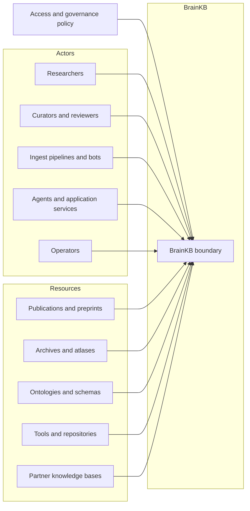

### L1 - System

Question answered: what can users and products do with BrainKB?

L1 shows BrainKB as a single system — its product workflows and the interface it exposes. Internal decomposition is not shown here; that belongs at L2.

Product capabilities:

- Evidence review: entity search/detail, claim comparison, conflict/silence states, provenance drilldown.
- Curation: candidate claim review, structured edits, batch publish request, validation report review.
- Release administration: graph release visibility, activation status, rollback target, projection readiness.
- Research workspace: saved searches, collections, task context, and explicit memory controls.
- Grounded assistant: plain-language queries with cited graph answers.

Out of scope at L1:

- Internal services, stores, deployment choices, and schema details.

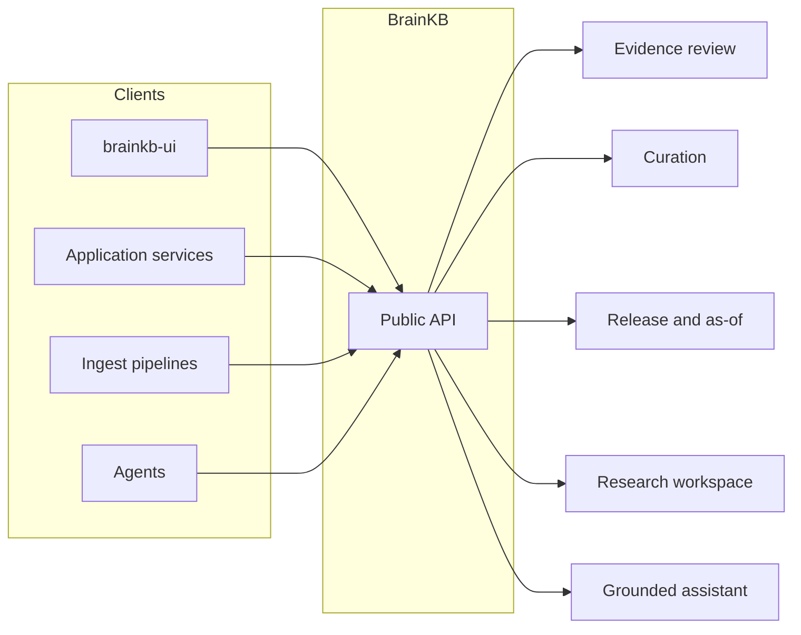

### L2 - Containers

Question answered: what are the tiers and how do dependencies flow?

BrainKB is organized in five tiers with dependencies flowing strictly downward.

- **Frontend** — web UI and researcher/curator surfaces
- **Application services** — use-case packages built on top of core (structsense, knowledgesynth, prisma-review)
- **Core services** — the shared platform: knowledge graph, ingest, job orchestration, connectors, identity
- **Storage** — RDF triplestore, relational/vector store, object storage
- **External services** — reached only through the connector layer: LLM APIs, federated KBs, parsers, ontology services

Dependency rules:

- Frontend calls application services only.
- Application services compose core services — never call externals directly.
- Only core services touch storage.
- All outbound calls to external services go through the connector layer.

Out of scope at L2:

- Specific service names, ports, and workflow internals — those belong at L3.

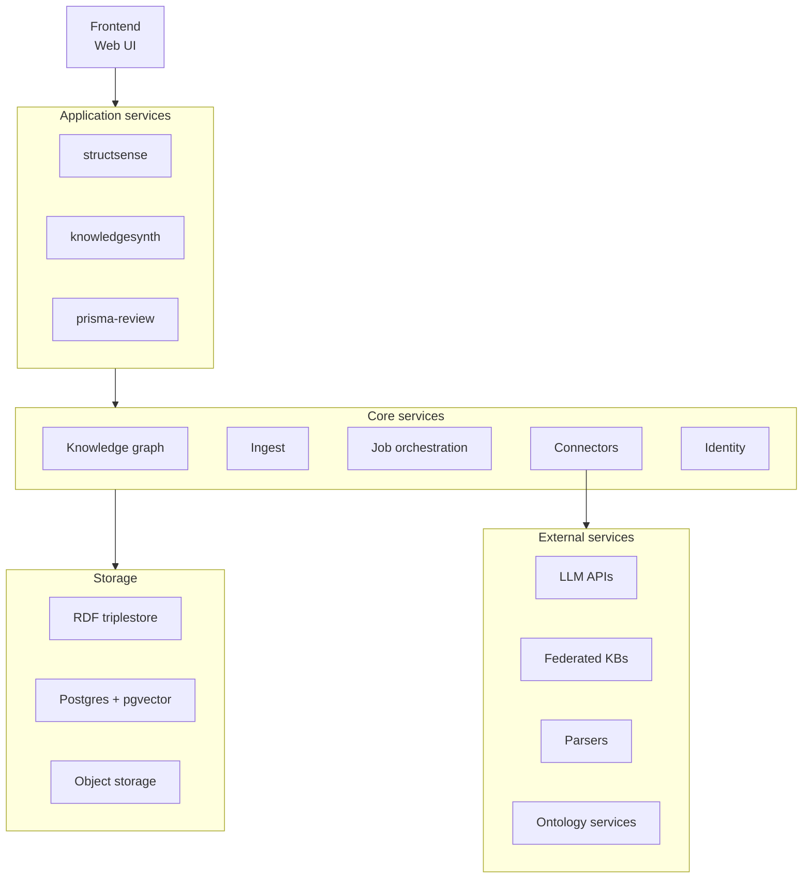

### L3 - Key Flows

Question answered: how do the key workflows move through the system?

Key flows:

- **Search and entity detail** — query → entity hydration → evidence badges → cache lookup/fill
- **Ingest** — submit → validate profile → write named graph → build projection → activate release → invalidate caches
- **Provenance audit** — claim lookup → evidence node hydration → source/contributor/schema rendering
- **Federated query** — connector calls → cache state → source attribution
- **Grounded assistant** — retrieve scoped memory → retrieve IRIs → hydrate claims → cited answer
- **Release activation** — validate manifest → graph diff → projection parity checks → activate → revalidate memory

Out of scope at L3:

- Data model internals and deployment topology.

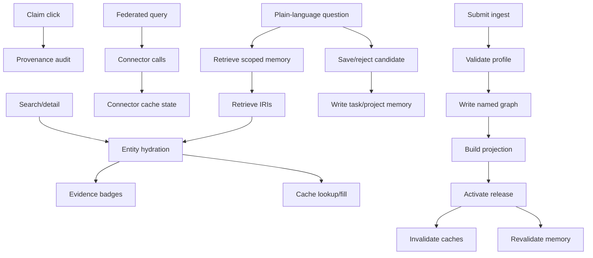

### L4 - Knowledge/Data Model

Question answered: what data model makes trust and evolution possible?

- **Identity**: stable IRIs, ORCID, DOI, dataset IDs, file/asset IDs, Patch-seq cell/specimen IDs, gene IDs, cross-references.
- **Domain model**: BICAN, openMINDS, NIMP, taxonomy releases, cell/specimen/file assets, tool/model entities, datasets, claims.
- **Standards and vocabularies**: LinkML, SHACL, BIDS, NWB; UBERON, CL, NCBITaxon, biolink categories.
- **Provenance**: PROV-O, source, contributor, generated-by, derived-from, timestamp.
- **Versioning**: named graphs per source/release/contribution, supersession edges, lifecycle states, as-of queries.
- **Claim bundles**: stable claim IDs, qualifiers, evidence nodes, activity/agent/source lineage, confidence/evidence labels, review lifecycle state.
- **Release manifests**: immutable release ID, source checksum, transform digest, validation report, projection schema version, activation timestamp, rollback target.

Contracts governing how read models and derived indexes must preserve these properties are in the Contracts section.

Out of scope at L4:

- UI layouts, product grouping, and container deployment diagrams.

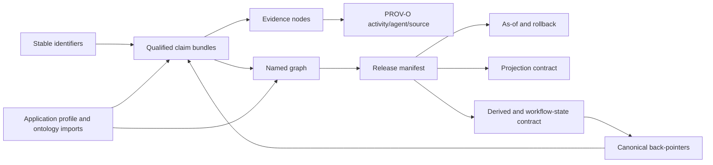

## Key Sequence Flows

Seven flows cover the full runtime surface of BrainKB. Each diagram uses the actual service names from the L2 architecture.

### Seq 1 — User Search Query

Frontend resolves a page config, mints a service JWT, then issues a SPARQL SELECT against kg-api.

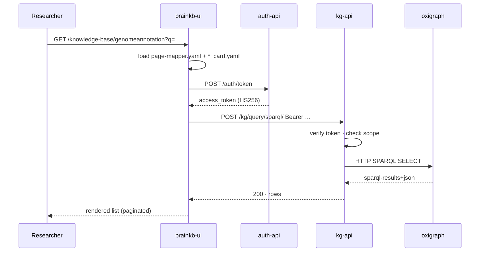

### Seq 2 — Data Ingestion Pipeline

External pipelines push validated RDF; kg-api validates, stages, and inserts into a per-source named graph.

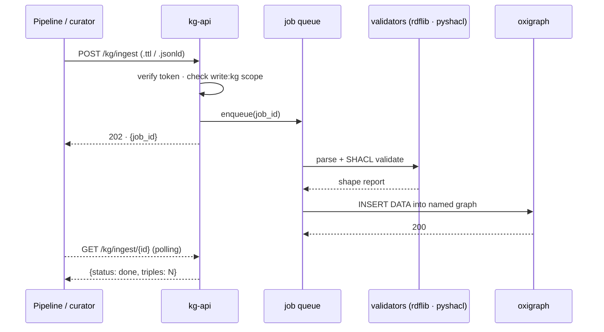

### Seq 3 — Entity Detail and Traversal

A detail page is a stack of templated CONSTRUCT queries — one per box, plus optional outbound dereference of linked IRIs.

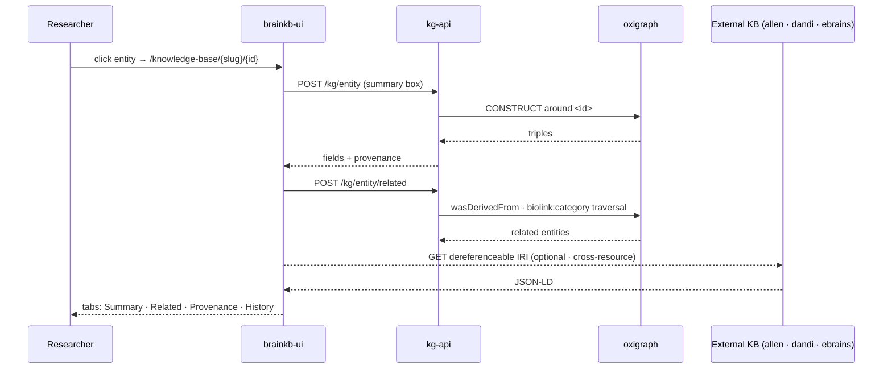

### Seq 4 — Authentication and Authorization

NextAuth handles human identity; auth-api mints service JWTs. Every protected endpoint verifies the shared HS256 secret and checks the embedded scope claim.

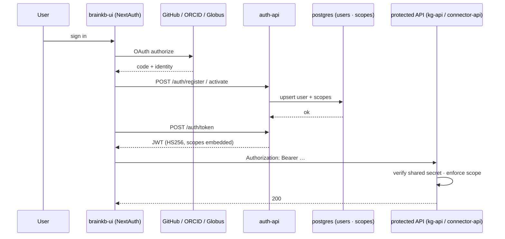

### Seq 5 — Cross-Resource Federated Query

SPARQL SERVICE clauses fan out to RDF-native KBs; REST adapters lift JSON resources into ephemeral triples.

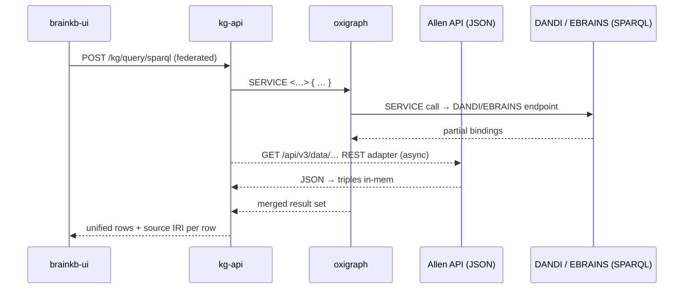

### Seq 6 — Curator Extract, Review, and Publish

structsense streams candidate extractions over WebSocket; the curator approves, then approved RDF lands in oxigraph through the standard ingest path. Drafts live in postgres so review state survives across sessions.

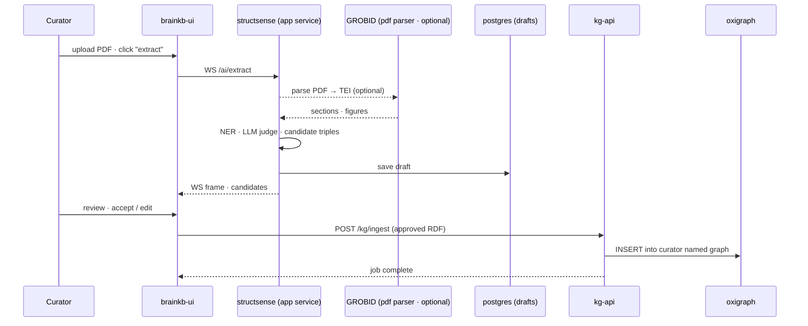

### Seq 7 — LLM-Assisted Query (RAG over the KG)

Retrieval is grounded in IRIs from pgvector; SPARQL hydration ensures every answer is backed by triples — citations are real graph nodes.

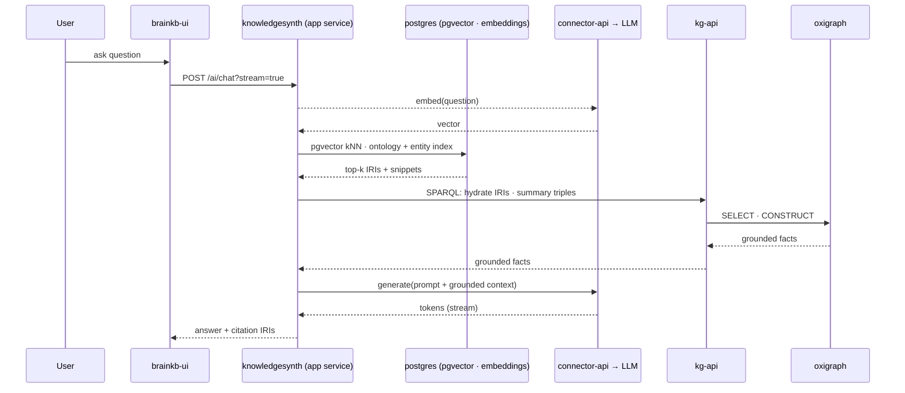

---

# Part 3 · MVP

## MVP Competency Fixture

Purpose: prove that BrainKB can answer a bounded neuroscience evidence-review question with enough concrete data to expose identity, provenance, versioning, source disagreement, projection behavior, file-level lineage, literature-derived claims, and reusable platform services.

Primary competency question:

> For a basal ganglia taxonomy atlas class, Patch-seq cell, gene, gene set, or related preprint, can BrainKB show the taxonomy assignment, BICAN model/release context, h5ad/source assets, gene and gene-set evidence, Patch-seq cell IDs, file-level archive artifacts, related publications, people, resources, claims, estimated analysis graphs, support/conflict/silence states, and graph version as of a selected date?

BG integration fixture scope:

- Atlas and taxonomy package:
  - Use the ABC Atlas / Human-Mammalian Brain Atlas Basal Ganglia package as the running seed resource.
  - Capture the BICAN model or application profile used by the atlas package.
  - Represent taxonomy release/version, class IDs, labels, aliases, hierarchy, crosswalks, species, anatomical region, assay/modality, and lifecycle state.
  - Preserve links to h5ad assets, expression matrices, metadata tables, spatial assets, gene expression matrices, marker genes, gene sets, and Patch-seq component references.
- Cell and specimen identity:
  - Represent gene names with stable gene identifiers and explicit source vocabulary/version.
  - Represent Patch-seq cell IDs, specimen IDs, taxonomy assignments, mapping method, mapping confidence, and quality-control state.
  - Resolve associated archive assets at file/asset level when available, not only dataset-level metadata.
  - Store dataset ID, asset/path/file ID, checksum or version, modality, format such as NWB or h5ad, and cell/specimen-level linkage.
- Publication and claim network:
  - Represent bioRxiv/preprint/publication records where the taxonomy was created, described, reused, or cited.
  - Extract or curate people, organizations, affiliations, resource mentions, dataset/tool/atlas references, and relevant identifiers.
  - Represent claims and evidence from text, figures, tables, notebooks, and estimated analysis graphs as reviewable claim bundles.
  - Preserve support, conflict, "not stated", inferred, superseded, and replaced states with graph release/as-of context.
- Reusable platform and tooling:
  - Build the fixture with adapters and transforms that are reusable outside BG: ABC Atlas adapter, h5ad metadata extractor, gene/gene-set resolver, Patch-seq cell mapper, DANDI/BIL/NeMO-style asset resolver, publication/NER/claim extractor, analysis-graph/evidence packager, provenance exporter, release manifest builder, projection parity checks, cache invalidation, and memory revalidation.
  - Treat BG as an integration test for shared platform capabilities, not as a one-off hardcoded demo.

Competency tasks:

- Given a BG taxonomy class, show marker genes/gene sets, species/region/modality qualifiers, BICAN model/release context, h5ad cells/assets, Patch-seq cells, source publications, and evidence state.
- Given a Patch-seq cell ID, show taxonomy class assignment, mapping method/confidence, source h5ad or NWB/file assets, archive asset links, related publications, and evidence graph.
- Given a gene or gene set, show related BG taxonomy classes, marker/evidence claims, source assets, source releases, and conflict/silence states.
- Given a paper or preprint, show detected people, organizations, resources, datasets, tools, atlas mentions, claims, source fragments, figures/tables when available, and links to taxonomy/assets.
- Given an as-of date, show which taxonomy classes, assets, claims, publications, mappings, and release manifests were active, superseded, deprecated, or unavailable.

Required graph object types:

- `TaxonomyRelease`, `TaxonClass`, `Cell`, `Specimen`, `Gene`, `GeneSet`, `Dataset`, `FileAsset`, `Publication`, `Preprint`, `Person`, `Organization`, `Resource`, `Claim`, `Evidence`, `AnalysisGraph`, `Notebook`, `WorkflowRun`, `ModelProfile`, `IdentifierMapping`, and `ReleaseManifest`.

Researcher success criterion:

- A neuroscientist can start from a BG taxonomy class, Patch-seq cell ID, gene/gene set, file asset, or bioRxiv/preprint record and reach taxonomy context, supporting evidence, source files, people/resources/claims, and release/as-of state in less than five minutes.

## MVP Scope

The MVP should be framed as a trustable evidence-review and ingest slice, not a broad discovery assistant.

MVP capabilities:

- Search by label, synonym, identifier, and fixture-specific source accession.
- Entity detail pages with source-attributed properties and evidence badges.
- Claim-level provenance drilldown with source, contributor, activity, graph, schema, release, and lifecycle state.
- Curated claim ingest from fixture data or manually authored paper-derived claims.
- Named graph release creation, validation, projection readiness, activation, and rollback.
- Optional GraphQL/Postgres projections for high-traffic read views, provided parity checks against canonical RDF pass.
- Local/self-hosted demonstration with reproducible fixtures and external services disabled, mocked, or clearly marked optional.

Post-MVP or gated capabilities:

- Hypothesis generation over broad neuroscience knowledge.
- Grounded assistant answers beyond the seeded fixture.
- General cross-KB federation across heterogeneous live sources.
- Automated ingestion from many partner release practices.
- Evidence-strength scoring across heterogeneous claims at production scale.
- Broad methods/models recommendation beyond a small structured catalog.

Hypothesis and assistant guardrails (apply beyond MVP):

- Initial outputs should be framed as candidate gap surfacing, triage, or evidence expansion, not discovery of new biological facts.
- The system should expose sparse-graph bias, literature-retrieval bias, ontology-mapping uncertainty, correlation-versus-mechanism limits, and species/modality transfer risk.
- A generated suggestion should not be written to the canonical graph without curator or reviewer action.
- If local evidence coverage is low, the product should fall back to search, external evidence expansion, or "insufficient evidence" rather than over-answering.

---

# Part 4 · Contracts

## Contracts

Contracts define the non-negotiable behaviors that BrainKB must satisfy across all services, releases, and integrations. They are not implementation recipes — they are the commitments that engineering decisions must preserve.

## Identifier Governance Contract

BrainKB needs explicit identifier governance because almost every epic depends on stable identity and explainable cross-resource alignment.

MVP fixture identifier rules:

- Every seed entity must have a canonical BrainKB IRI before review.
- Every seed entity should carry at least one resolvable external identifier or source-specific accession when one exists.
- Placeholder identifiers may be used only in internal fixture drafts; they must not appear in production as if they were real external IDs.
- Cross-resource equivalence must state its relation type: exact match, close match, broad/narrow match, related match, or unresolved candidate.
- Patch-seq cell/specimen IDs and file assets must remain queryable as first-class identifiers, even when the public-facing question starts from a taxonomy class, gene, or paper.

Canonical IRI policy:

- BrainKB may mint canonical IRIs for platform-owned entities, claims, graph releases, activities, and fixture records.
- Canonical IRIs should follow stable, documented patterns by entity class; generated IDs must not encode mutable labels.
- Source-specific identifiers must be preserved as cross-references, not discarded after canonicalization.
- The resolver should return labels, type, lifecycle state, equivalent identifiers, graph/release context, and deprecation or supersession metadata.

Equivalence policy:

- Use `owl:sameAs` only for very strong identity equivalence.
- Prefer SKOS-style mapping relations for most cross-resource alignments: exact match, close match, broad match, narrow match, related match, and candidate match.
- Each xref or mapping must have provenance: source, method, contributor or service, date, confidence, and graph/release context.

Merge, split, and deprecation policy:

- Merges should create explicit replacement edges and preserve old IRIs as resolvable deprecated identifiers.
- Splits should preserve the historical entity and point to replacement entities with rationale.
- Deprecated or superseded identifiers must remain queryable for as-of and provenance workflows.
- Projections must carry canonical IRI, source xrefs, mapping confidence, and lifecycle state so UI reads do not hide identity uncertainty.

## Claim And Provenance Contract

The unit of knowledge should not be an unqualified triple. BrainKB should represent each user-visible assertion as a qualified claim bundle.

Claim fields:

| Field | Required meaning |
| --- | --- |
| `claim_id` | Stable claim identifier exposed in RDF and projections. |
| `subject_iri` | Canonical BrainKB entity IRI. |
| `predicate_iri` | Predicate from the application profile. |
| `object_iri_or_value` | Object entity IRI or literal value. |
| `species_id` | Taxon identifier, such as `NCBITaxon:10090` or `NCBITaxon:9606`. |
| `region_id` | Anatomical region identifier when available. |
| `assay_or_modality` | Experimental modality or assay context. |
| `source_id` | Publication, dataset, release, or upstream resource identifier. |
| `evidence_id` | Evidence node or source fragment backing the claim. |
| `provenance_activity` | How the claim was created: imported, extracted, inferred, curated, reviewed, activated, superseded, or withdrawn. |
| `agent` | Who or what created the claim: curator, reviewer, service principal, extraction model, or transform job. |
| `support_state` | Supported, conflicting, refuted, not stated, inferred, or pending review. |
| `evidence_grade` | Lightweight confidence/evidence-strength label, not a claim of scientific certainty. |
| `graph_uri` | Named graph containing the claim. |
| `release_id` | Immutable graph release identifier. |
| `as_of` | Date or timestamp used for as-of query behavior. |
| `lifecycle_state` | Draft, active, superseded, deprecated, or withdrawn. |

Modeling direction:

- Use named graphs to preserve source/release/contribution boundaries.
- Consider a nanopublication-like or RDF-star-compatible representation for qualified statements, but do not require the deck to choose syntax before modeling requirements are agreed.
- PROV-O should express activity, agent, entity, derivation, generation time, and source lineage.
- SHACL or equivalent validation should enforce required provenance fields before activation.

Evidence UX constraint:

- Default views should first answer: what is the claim, what supports/refutes it, which paper/dataset/release says so, which species/region/modality applies, and whether the assertion is curated, imported, inferred, extracted, or superseded.
- Full PROV-O lineage should be one drilldown away, not the first thing a scientist must parse.

## Graph Release And Projection Contract

Automated ingest and GraphQL/Postgres projections require a release contract that makes activation observable and reversible.

Release manifest requirements:

- Immutable `release_id`.
- Named graph URI or graph set URI.
- Source resource, upstream release identifier, source checksum, and retrieved-at timestamp.
- Transform code version, container digest or workflow digest, and configuration hash.
- Application profile/schema version and validation report pointer.
- Graph diff pointer against the previous active release.
- Projection schema version and projection validation report.
- Activation timestamp, activated-by agent, previous active release, and rollback target.
- External dependencies and connector versions used during build.

Activation rule:

- The active release pointer changes only after graph validation, projection build, projection parity checks, and readiness checks pass.
- From the user's perspective, RDF reads and GraphQL/Postgres projection reads must expose the same active release or clearly report a stale/unready projection state.
- If projection readiness fails, the previous active release remains visible and the failed release remains inspectable.

Ingest and activation state machine:

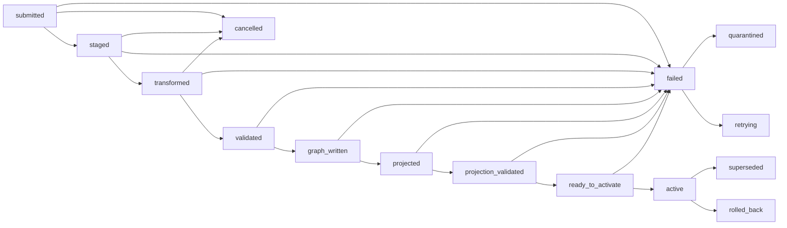

Projection parity requirements:

- GraphQL objects and Postgres read models must expose canonical IRI, claim ID, graph URI, release ID, schema version, evidence links, lifecycle/as-of state, and projection freshness.
- Parity tests should compare a small set of canonical RDF/SPARQL answers against GraphQL/Postgres responses for the fixture competency questions.
- Projection schema evolution must be versioned and tied to release manifests.

## Operational Readiness Contract

This contract makes deployability and operations reviewable rather than leaving them as implied implementation detail.

Deployment targets:

- Local fixture mode: Docker Compose or equivalent local stack with Oxigraph, Postgres, Redis if needed, seed fixtures, mocked connectors, disabled or stubbed LLM calls, and deterministic rebuild.
- Self-hosted mode: documented volumes, migrations, secrets, TLS/proxy expectations, backup locations, and upgrade path.
- Production mode: Kubernetes or equivalent deployment with health checks, readiness checks, persistent volumes, service accounts, and controlled activation jobs.

Ingest/job requirements:

- Jobs expose state, progress, current phase, input manifest, validation report, retry count, cancellation state, activation readiness, projection freshness, and final release ID.
- Long-running jobs support cancellation before activation.
- Backpressure and queue depth should be visible so partner releases or extraction jobs do not overwhelm the system.

Observability requirements:

- Metrics: ingest duration, validation failure rate, queue depth, projection lag, activation failures, stale reads, cache hit/miss/stale rates, cache invalidation failures, memory promotion/rejection counts, embedding freshness, connector latency/error rate, external rate-limit hits, LLM call count/cost/error rate, auth failures, backup freshness, and restore-test age.
- Logs: request ID, job ID, release ID, graph URI, actor/service principal, connector name, upstream source, and error category.
- Traces: each service (`kg-api`, `ingest-api`, `jobs-api`, `connector-api`, `auth-api`) is a trace root for its own operations; the gateway or UI is the trace root for browser workflows. All spans propagate request ID, user/session/project, release/as-of context, job ID, projection freshness, cache status, partial-result status, and downstream service/module spans for ingest, projection, cache lookup/fill/invalidation, memory read/write/promotion, search, provenance lookup, federation, and assistant retrieval.
- SLO candidates: read availability, search latency, cache freshness, memory retrieval latency, projection lag after activation, ingest success rate for fixture packages, and restore time.

Auth and scope matrix:

| Role | Read | Draft | Validate | Activate | Administer | External calls |
| --- | --- | --- | --- | --- | --- | --- |
| Anonymous reader | Public graph only | No | No | No | No | No |
| Authenticated researcher | Public and permitted graphs | Saved collections only | No | No | No | Optional, user-scoped |
| Curator | Permitted graphs | Yes | Yes | No | No | Via approved connectors |
| Reviewer | Permitted graphs | Yes | Yes | Approve within scope | No | Via approved connectors |
| Service principal | Scoped graph/package access | Yes | Yes | Scoped activation | No | Scoped, audited |
| Admin | All | Yes | Yes | Yes | Yes | Yes, audited |
| Connector operator | Operational metadata | No | No | No | Connector config only | Yes, audited |

Browser-facing auth rule:

- `brainkb-ui` authenticates with the gateway/BFF only. The gateway enforces the user/session/project/release policy and calls internal services with service identity plus propagated user and scope claims.

Backup and restore:

- Define RPO/RTO targets before production implementation.
- Back up Postgres, triplestore/named graph snapshots, release manifests, validation reports, durable connector caches, project/task memory, vector indexes or their rebuild manifests, and object/artifact storage.
- Treat Redis or queue state as non-durable unless configured otherwise.
- Run restore drills using the basal ganglia fixture and at least one superseded release.
- Preserve rollback targets for active graph releases.

External service boundaries:

- Connectors own credentials, rate limits, caching, attribution, retry policy, privacy/data-egress checks, and outage behavior.
- The UI should distinguish local evidence, cached external evidence, live external evidence, memory-derived context, and unavailable sources.
- External failures should produce partial-result states where appropriate, not silent empty answers.

## Ontology Alignment And FAIR Contract

Ontology and schema alignment should be a named workstream, not a hidden data-cleaning task.

Vocabulary layer stack:

BrainKB uses a layered vocabulary model rather than a single ontology. Each layer answers a different alignment question:

| Layer | Vocabularies | Role |
| --- | --- | --- |
| Upper | biolink-model | Entity categories: Gene, Disease, AnatomicalEntity, … |
| Domain | BICAN · openMINDS · NIMP | Cell taxonomies, experiments, datasets |
| Standards | BIDS · NWB · LinkML | Data structure and metadata schemas |
| Provenance | PROV-O | `wasDerivedFrom` · `wasGeneratedBy` · Agent |
| Reference | UBERON · CL · NCBITaxon | Anatomy, cell types, species |
| Identity | IRIs · ORCID · DOI | Stable, dereferenceable identifiers |

Application profile:

- Define the minimal BrainKB application profile for the MVP fixture: entity classes, predicates, claim qualifiers, provenance fields, release fields, and validation shapes.
- Express the application profile as LinkML schemas and SHACL shapes; apply `rdflib` and `pyshacl` during ingestion validation.
- Version the application profile and tie each graph release to the profile version used for validation.

Ontology import and alignment:

- State which versions of BICAN, openMINDS, NIMP, BIDS, NWB, UBERON, CL, NCBITaxon, biolink, and other vocabularies are imported or referenced.
- Express crosswalk mappings using SKOS equivalence relations (`skos:exactMatch`, `skos:closeMatch`, `skos:broadMatch`); preserve mapping confidence, method, and lifecycle as named-graph provenance.
- Validate term usage across the MVP fixture before presenting a claim as active.
- Track term deprecation, replacement, and unresolved mapping candidates.

FAIR and export metadata:

- Each graph release must include machine-readable metadata covering citation, license/access constraints, source attribution, schema/profile version, checksums, and provenance.
- Export packages must conform to at least one structured metadata standard: RO-Crate, DataCite, or schema.org. Choose before the first public release and version the choice.
- Exportable snapshots must include enough manifest and provenance metadata to reproduce the fixture review without relying on hidden local state.

---

# Part 5 · Strategy

## Store And Query Strategy

RDF is the lingua franca for knowledge; everything else lives in Postgres. The query layer hides the seam.

Polyglot persistence:

| Engine | Query | Role |
| --- | --- | --- |
| Oxigraph (RDF/named graphs) | SPARQL | Canonical knowledge store: claims, provenance, federation, versioning, named-graph-per-source |
| Postgres + pgvector | SQL + vector kNN | Users, scopes, jobs, ingest state, operational metadata; embeddings and read projections |
| Local filesystem | files | TTL/JSON-LD/RDF dumps, PDF uploads, Oxigraph data directory |

Baseline decision:

- RDF/named graphs are the canonical model for claims, provenance, source boundaries, versioning, and federation semantics.
- The public API surface (the gateway layer or the service that the UI faces) owns product API contract, auth/session enforcement, release/as-of context, and routing to internal services.
- `kg-api` owns writes, validation, and canonical query semantics regardless of the backing triplestore implementation.
- Postgres already stores operational state; it may also hold denormalized read models for common entity, evidence, search, dashboard, task-memory, and agent-memory views.
- Caches and memory stores improve performance and workflow continuity, but they do not become canonical knowledge unless a reviewed promotion writes through the standard claim/provenance path.
- `brainkb-ui` and browser-based agents should call only the public API surface; they should not call graph, ingest, job, cache, memory, connector, or store APIs directly.

GraphQL/Postgres variant:

- Add a GraphQL read mode on the public API surface, or as a dedicated module behind it, backed by Postgres tables or materialized projections derived from canonical RDF/named graphs.
- Use GraphQL for high-traffic UI patterns that are awkward or slow to express directly as SPARQL: entity detail pages, nested evidence views, faceted search, timelines, review queues, and dashboard summaries.
- Keep SPARQL/RDF available for graph-native queries, federation, provenance audits, schema/version operations, and expert workflows.
- Treat GraphQL objects as read models with explicit semantics, not as a second source of truth.
- Expose canonical IRI, claim ID, graph URI, release ID, schema/profile version, evidence links, lifecycle/as-of state, and projection freshness on relevant GraphQL objects.

Service design implications:

- The triplestore plus an optional GraphQL/Postgres read projection is a deliberate performance boundary, not an accidental duplicate source of truth.
- Projection and cache semantics that must survive any read path: provenance, versioning, named graph membership, identifier stability, auth scope, and release context.
- Sync rules and projection lifecycle requirements are defined in the Graph Release And Projection Contract.

## API Boundary And Service Decomposition

The architectural boundary matters more than the initial packaging. BrainKB can preserve its trust contracts with separate services without exposing all of them directly to the browser.

Service topology:

| Service | Browser-facing | Role |
| --- | --- | --- |
| `kg-api` | Internal | Graph reads, writes, validation, canonical SPARQL queries |
| `ingest-api` | Internal | Ingest submission, manifest handling, source registration |
| `jobs-api` | Internal | Job status, progress, cancellation, activation control |
| `connector-api` | Internal | Credential isolation, rate limiting, connector orchestration |
| `auth-api` | Internal | OAuth2/JWT issuance, scope enforcement, session management |
| Gateway / BFF | Yes | Routes product-shaped requests to internal services; enforces user/session/release context |
| `brainkb-ui` | Yes | Browser client; calls only the gateway/BFF surface |

Decomposition rationale:

- Each service owns its own boundary: credentials, scaling, failure domain, and deployment lifecycle are independent.
- The gateway or BFF layer is the only surface the UI and browser-based agents should call. It translates product operations (search, entity detail, evidence view, review queue, ingest status) into internal service calls.
- Services that should never be directly browser-facing: triplestore, Postgres/pgvector, Redis, object storage, cache internals, memory stores, and external LLM/search/archive endpoints.
- A service earns a separate deployable when credential isolation, rate limiting, ownership, or failure domain requires it — not because it has a name.

## Cache And Agent Memory Strategy

BrainKB should treat caching and agent memory as related but distinct platform capabilities. Cache is a performance and resilience boundary. Memory is workflow state for researchers and agents. Neither should silently create facts in the canonical graph.

Cache service:

- The cache module (split later as `cache-api` only if needed) provides a deterministic cache facade for entity hydration, provenance lookup, release readiness, connector responses, federated subquery results, search facets, and expensive LLM/tool-call intermediates.
- Cache keys should encode: release and schema version, source/resource identity, query template version, auth scope, and tenant/project. This ensures cache entries are never silently shared across releases or permission boundaries.
- Cache entries should expose status metadata (hit, miss, stale, negative cache) and enough provenance (source timestamp, TTL, invalidation reason) for the UI to distinguish live results from cached ones.
- Graph release activation should namespace or invalidate cache entries by release and schema version rather than mutating old results in place.
- Redis backs hot short-TTL cache; Postgres or object storage backs durable connector/result caches where replay, rate-limit protection, or offline review matter.
- Cache health (misses, stale reads, invalidation failures, upstream retry behavior) should be observable.

Agent memory components:

- Ephemeral working memory: current conversation/task context, selected entities, active filters, retrieved evidence, tool results, and UI state. It is user/session scoped, short TTL, resumable within a session, and discarded unless promoted.
- Short-term task memory: active research workspace with query plans, candidate hypotheses, scratch collections, rejected suggestions, retrieval traces, and partial review state. It is user/project scoped, expires or archives, and can support multi-step agent work.
- Long-term project/user memory: saved collections, reviewed claims, reusable query templates, trusted-source preferences, vocabulary choices, researcher goals, and explicit "remember this" notes. It requires user-visible control and should be exportable.
- Institutional/platform memory: curated ontology mappings, release validation outcomes, connector reliability history, benchmark results, answer-quality evaluations, and reusable workflow templates. It is admin or reviewer governed.
- Semantic/vector memory: embeddings for entities, claims, papers, datasets, tools, workflows, and memory items. Vector entries are derived indexes that must point back to canonical IDs, evidence, release context, and embedding model version.
- Provenance/audit memory: prompts, model/provider metadata, tool calls, retrieval sets, source snippets, generated drafts, and reviewer decisions when they influence user-visible answers or candidate claims.

Memory lifecycle and promotion rules:

- The memory module, exposed internally and split later as `memory-api` only if needed, owns memory reads, writes, retention, promotion, and deletion; UI code and agents should not write directly to store tables.
- Every memory item should carry enough metadata to answer: who owns it, what scope it belongs to, where it came from, when it expires, which graph release it was valid for, and what privacy/auth policy applies.
- Promotion path is explicit: ephemeral memory can become task memory; task memory can become project memory; project memory can propose candidate claims; candidate claims enter the canonical graph only through review, validation, named graph write, and release activation.
- Memory can bias retrieval and workflow continuity, but it cannot replace evidence. Agent answers must cite canonical entities, claims, papers, datasets, or explicitly labeled external results.
- Stale memory must be revalidated when graph releases, ontology mappings, projection schemas, or connector versions change.
- Private user/project memory must not be used as institutional memory or model-training/evaluation input without explicit policy and consent.

---

# Part 6 · Epics and Traceability

## Epic User Stories

Each story follows the same template so it can be turned into issues or implementation slices without reinterpreting intent.

Bootstrap dependency priority uses ease of resolution, not importance:

- Easy: can be seeded from existing documentation, a small curated fixture, public metadata exports, or simple adapters.
- Medium: needs schema alignment, repeated curation, service integration, or a reliable sync/update process.
- Hard: depends on substantial KB coverage, external search/retrieval services, model evaluation, cross-resource agreement, or sustained curator/researcher feedback.

### Epic 01 - Knowledge Review

Actor: researcher or reviewer

Goal: review everything BrainKB knows about an entity or claim, including agreement and conflict across sources.

Value: users can evaluate the field's state of knowledge without flattening contradictory evidence into a single asserted fact.

Trigger: a user searches for an entity, opens a property, or asks "what do we know about this?"

Preconditions:

- Entities have stable identifiers or resolvable cross-references.
- Claims are stored with source, contributor, timestamp, and schema version.
- Named graphs preserve source boundaries.

Acceptance criteria:

- Entity views group assertions by predicate and source.
- Conflicting claims are visible together, not silently collapsed.
- Each claim links to evidence, source resource, contributor, and graph/version metadata.
- Users can filter or compare by source, version, and as-of date.
- Entity pages exist for taxonomy classes, Patch-seq cells/specimens, genes, gene sets, file assets, datasets, papers/preprints, people, organizations, resources, claims, and evidence.
- The UI exposes file-level lineage and source asset links, not just top-level dataset metadata.
- Publication-derived claims show whether they were manually curated, NER/extraction-derived, inferred from an analysis graph, or imported from a source package.
- Reusable adapters and derived artifacts are named in release manifests so other domains can reuse the same services and tooling.

Architecture dependencies: L0 external resources, L1 evidence review workflow, L2 gateway/BFF, kg-api, canonical graph store, L3 entity search/detail and provenance lookup, L4 named graphs and PROV-O.

Bootstrap assumptions and dependencies, ordered easiest to hardest:

- Easy: seed a small entity set from the BG taxonomy atlas fixture with stable IRIs, labels, synonyms, source links, BICAN model/profile context, and a few manually curated claims.
- Easy: include a minimal set of taxonomy classes, h5ad assets, gene/gene-set evidence, Patch-seq cell IDs, file assets, and source papers/preprints so the UI can traverse from any entry point.
- Easy: require every seed claim to include source, contributor placeholder, timestamp, schema version, and named graph URI.
- Medium: curate enough overlapping claims across at least two sources to demonstrate agreement, disagreement, and "not stated" states.
- Medium: build or project common entity/evidence views into Postgres/GraphQL if direct SPARQL reads are too slow for UI iteration.
- Hard: assign defensible evidence-strength scores across heterogeneous sources without overclaiming scientific certainty.

### Epic 02 - Hypothesis Generation

Actor: researcher

Goal: surface plausible hypotheses from graph structure, gaps, analogies, contradictions, and similarity.

Value: BrainKB helps users discover candidate ideas while keeping generated suggestions grounded and reviewable.

Trigger: a user starts from an entity, region, species, marker set, or graph pattern and asks what might be implied.

Preconditions:

- Core graph search and entity hydration are available.
- Similarity signals exist for entities, claims, or documents.
- The system can cite graph nodes behind any generated suggestion.
- Task memory can retain query plans, rejected ideas, retrieved evidence, and candidate drafts without treating them as graph facts.

Acceptance criteria:

- Suggested hypotheses are labeled as candidates, not facts.
- Each suggestion includes supporting evidence, missing evidence, and possible counterevidence.
- The system exposes the source nodes, paths, or neighbors used to create the suggestion.
- Users can save, reject, or send a suggestion to curator review without committing it to the canonical graph.
- Saved or rejected suggestions are stored as task/project memory with release context and can be revalidated when the graph changes.

Architecture dependencies: L1 gated assistant/hypothesis workflow, L2 gateway/BFF, kg-api, connector-api, memory module, Postgres/pgvector, L3 LLM-assisted query, memory promotion, and graph hydration, L4 identifiers, claim provenance, and workflow-state semantics.

Bootstrap assumptions and dependencies, ordered easiest to hardest:

- Easy: limit initial hypotheses to "candidate connections" over the seed graph, such as shared markers, shared regions, missing evidence, or source disagreement.
- Easy: expose the underlying graph paths and retrieved nodes before attempting polished natural-language synthesis.
- Easy: store candidate, saved, and rejected suggestions as scoped task memory so users can resume exploration and review what the agent already tried.
- Medium: populate enough claims, entity embeddings, and paper/dataset metadata to make similarity results useful rather than trivial.
- Medium: integrate external discovery services such as PubMed, Semantic Scholar, Google Scholar-like search, repositories, or archive APIs as evidence expansion sources.
- Hard: produce scientifically useful hypothesis suggestions, because this depends on KB coverage, external literature retrieval quality, model behavior, and researcher feedback loops.

### Epic 03 - Methods and Models Catalog

Actor: methodologist or analyst

Goal: find tools, models, and pipelines that fit a dataset and understand when they fail.

Value: tool selection becomes a query over applicability, benchmark evidence, and failure modes instead of a manual literature search.

Trigger: a user describes a dataset signature, task, modality, species, scale, or noise regime.

Preconditions:

- Tools and models are represented as first-class graph entities.
- Applicability conditions and benchmark evidence are structured.
- Dataset metadata uses aligned vocabularies.

Acceptance criteria:

- Users can query for methods compatible with a dataset signature.
- Results show works-when, breaks-when, benchmark evidence, and source provenance.
- Incompatible tools are excluded or shown with clear contraindications.
- Tool versions, owners, inputs, and outputs are visible.

Architecture dependencies: L0 tools and registries, L1 methods/catalog workflow, L2 gateway/BFF, kg-api, canonical graph store, L3 query planning, L4 tool/model schema and provenance.

Bootstrap assumptions and dependencies, ordered easiest to hardest:

- Easy: seed a short catalog of tools/models from known project context with inputs, outputs, modality, species, scale, owner, version, and links.
- Easy: represent applicability conditions as structured metadata even before full ontology alignment is complete.
- Medium: add benchmark and failure-mode evidence from papers, docs, or curated notes for enough tools to make comparison meaningful.
- Medium: align dataset signatures to controlled terms so compatibility queries are not just keyword matching.
- Hard: maintain trustworthy failure-mode and benchmark claims across tool versions and heterogeneous datasets.

### Epic 04 - Resource Landscape

Actor: planner, new entrant, or infrastructure lead

Goal: understand which neuroscience resources exist, how they relate, and how their lifecycle changes over time.

Value: BrainKB becomes a time-aware map of resources, schemas, ontologies, archives, and initiatives.

Trigger: a user asks for active resources for a topic as of a date or across a time window.

Preconditions:

- Resources are first-class graph entities.
- Releases, lifecycle states, supersession, dependencies, and dates are captured.
- As-of graph selection is supported.

Acceptance criteria:

- Users can view resources by topic, status, date, and relationship.
- The UI shows active, superseded, deprecated, and retired resources.
- Version history and replacement edges are visible.
- The same lifecycle vocabulary applies to taxonomies, schemas, datasets, and tools.

Architecture dependencies: L0 resource ecosystem, L1 resource landscape workflow, L2 gateway/BFF, kg-api, canonical graph store, L3 as-of query support, L4 lifecycle vocabulary and named graph versioning.

Bootstrap assumptions and dependencies, ordered easiest to hardest:

- Easy: seed a resource registry for the resources already named in the source deck and BG fixture: BICAN, ABC Atlas/HMBA-BG, DANDI, BIL, NeMO, Allen Brain Atlas, NeuroMorpho, EBRAINS, BIDS, NWB, openMINDS, bioRxiv, PubMed/Semantic Scholar-style metadata, and relevant ontologies.
- Easy: capture minimal lifecycle metadata: active/superseded/deprecated/retired, homepage, API endpoint, release URL, and last checked date.
- Medium: add version edges, replaces/extends/dependency relations, and topic tags for a bounded neuroscience area.
- Medium: implement as-of graph selection or projection filters for a few versioned resources.
- Hard: keep the registry current across many independent resources without automated monitoring and review ownership.

### Epic 05 - Entity Exploration

Actor: neuroscientist or researcher

Goal: search for a cell type, dataset, region, paper, method, or claim and see the full connected picture.

Value: read-only exploration works without requiring users to know SPARQL, RDF, or source-specific identifiers.

Trigger: a user enters a name, synonym, identifier, or natural-language phrase.

Preconditions:

- Search indexes cover labels, synonyms, identifiers, and selected claim text.
- Entity detail pages can hydrate graph neighborhoods.
- External links and federated attributes are clearly attributed.

Acceptance criteria:

- Search resolves synonyms and cross-references to canonical entity pages.
- Entity pages show definitions, properties, related entities, source links, file-level assets, and evidence badges.
- BG fixture exploration works from taxonomy class, Patch-seq cell/specimen ID, gene, gene set, file asset, dataset, paper/preprint, person, resource, or claim.
- Read-only exploration works without login.
- Logged-in users can save searches or collections if identity is enabled.

Architecture dependencies: L1 search/detail workflow, L2 brainkb-ui, gateway/BFF, kg-api, canonical graph store, Postgres/pgvector projections, L3 search and drill-down flows, L4 identifiers and ontology mappings.

Bootstrap assumptions and dependencies, ordered easiest to hardest:

- Easy: choose the BG taxonomy atlas fixture and populate canonical entities, labels, synonyms, definitions, source links, file assets, and a few relationship types.
- Easy: build search over labels, synonyms, and identifiers before adding semantic search.
- Medium: add enough cross-references and ontology mappings to make synonym, Patch-seq cell/specimen, gene, gene-set, and file-asset resolution credible across resources.
- Medium: project entity detail read models into Postgres/GraphQL if direct graph traversal creates slow or brittle UI reads.
- Hard: provide a "full connected picture" across modalities and species without broad ingestion from archives, atlases, and papers.

### Epic 06 - Curated Claim Ingest

Actor: curator or domain expert

Goal: extract candidate claims from a paper or preprint, review them, and publish approved claims into the graph.

Value: experts can add structured knowledge without writing RDF by hand, while preserving human review and provenance.

Trigger: a curator uploads or references a publication and starts an extraction/review job.

Preconditions:

- Document parsing produces structured text and offsets.
- Extraction creates candidate entities and relations.
- Review state can persist before publication.
- Approved claims can be validated against schema.

Acceptance criteria:

- Candidate claims include source document, offsets, model/prompt metadata when relevant, and confidence.
- Curators can approve, edit, reject, or batch publish candidates.
- Approved triples are written through the standard ingest path.
- Published claims land in a named graph tied to the source and curator.

Architecture dependencies: L1 curator review workflow, L2 gateway/BFF, ingest-api, jobs-api, connector-api, Postgres, canonical graph store, L3 curator and ingest flows, L4 schema validation and provenance.

Bootstrap assumptions and dependencies, ordered easiest to hardest:

- Easy: start with manually authored candidate claims from one or two BG taxonomy papers/preprints instead of requiring automated extraction on day one.
- Easy: store draft review state in Postgres with links to source document, offsets where available, and target graph/schema version.
- Medium: integrate one PDF/text parser and one entity extraction path behind connector adapters or an app service boundary, with NER for people, organizations, resources, datasets, tools, atlas references, genes, and cell classes.
- Medium: represent figure/table/notebook-derived or estimated analysis-graph evidence as structured evidence nodes before writing canonical claims.
- Medium: define a minimal claim schema and SHACL validation path so approved claims can be written consistently.
- Hard: reach high-quality automated extraction across neuroscience papers, figures, tables, and terminology without sustained model and curator evaluation.

### Epic 07 - Automated Partner Release Ingest

Actor: pipeline, bot, or service principal

Goal: ingest a new upstream dataset, taxonomy, or schema release automatically and replace the previous active graph atomically.

Value: BrainKB can stay current with partner resources while preserving reproducibility and history.

Trigger: upstream release tag, scheduled job, webhook, or CI pipeline.

Preconditions:

- Machine credentials and scoped write tokens exist.
- Incoming data can be validated locally and by BrainKB.
- Versioned graph URIs and supersession policy exist.

Acceptance criteria:

- Pipelines can submit idempotent ingest jobs through a headless API.
- Validation reports and graph diffs are available before activation.
- New releases become active without deleting old releases.
- Failures leave the previous active graph untouched and produce actionable logs.

Architecture dependencies: L1 ingestion/release workflow, L2 ingest-api, jobs-api, canonical graph store, Postgres/Redis if needed, L3 auth and ingest flows, L4 named graph lifecycle.

Bootstrap assumptions and dependencies, ordered easiest to hardest:

- Easy: support file-based or fixture-based release ingest for the ABC Atlas/HMBA-BG package before building full upstream automation.
- Easy: require each ingest package to declare source, release ID, graph URI, schema version, and expected activation behavior.
- Medium: add validation reports, graph diffs, file-asset manifests, h5ad metadata summaries, and projection sync checks to the job lifecycle.
- Medium: add a repeatable Patch-seq-to-archive asset resolution step so cell/specimen-level file links update with the release.
- Medium: implement scoped service credentials for machine ingest.
- Hard: build reliable automated polling/webhooks and transforms for multiple partner resources with different release practices.

### Epic 08 - Cross-KB Federated Query

Actor: analyst or advanced researcher

Goal: ask one question whose answer spans local BrainKB knowledge and partner resources.

Value: BrainKB handles identity alignment, query planning, source attribution, and partial results so users do not export and join data by hand.

Trigger: a user builds a query that combines properties owned by different resources.

Preconditions:

- Equivalent entities are mapped to canonical identifiers or cross-references.
- External resources expose SPARQL, REST, file, or adapter-accessible interfaces.
- The system tracks latency, failure, and source attribution per external call.

Acceptance criteria:

- The query service can plan local and federated subqueries.
- Results reconcile by canonical URI and preserve per-cell provenance.
- Slow or unavailable sources degrade gracefully with visible status.
- REST-backed resources can be lifted into temporary graph-like results through connectors.

Architecture dependencies: L0 partner resources, L1 federated query workflow, L2 gateway/BFF, connector-api, cache module, L3 federation flow, L4 identity mapping and source attribution.

Bootstrap assumptions and dependencies, ordered easiest to hardest:

- Easy: demonstrate federation with one local graph and one mocked or stable external endpoint/adapter such as ABC Atlas metadata, archive asset lookup, or publication metadata.
- Easy: preserve source attribution per result cell even when the first query plan is hand-authored.
- Easy: cache connector responses with source, TTL, auth scope, and stale/partial-result status so repeated demos do not depend on live upstream behavior.
- Medium: align canonical identifiers or cross-references across two or three real resources such as ABC Atlas/HMBA-BG, DANDI/BIL/NeMO-style archives, bioRxiv/PubMed/Semantic Scholar-style publication metadata, and gene/ontology services.
- Medium: add timeout, partial result, and stale cache behavior so external failures are visible rather than mysterious.
- Hard: generalize query planning across heterogeneous SPARQL, REST, file, and repository sources with predictable performance.

### Epic 09 - Grounded Assistant

Actor: researcher

Goal: ask a plain-language question and receive a readable answer with citations to graph nodes, claims, papers, or datasets.

Value: natural-language interaction broadens access while keeping the answer grounded in BrainKB evidence.

Trigger: a user asks a question in an assistant panel or invokes a query-generation workflow.

Preconditions:

- Retrieval can return candidate entities and claims by semantic and graph context.
- The answer generator can hydrate retrieved IRIs through `kg-api`.
- LLM providers are routed through `connector-api` or a dedicated AI service boundary.
- Memory retrieval can supply user/project context while still respecting auth, release, and provenance constraints.

Acceptance criteria:

- Answers cite retrieved graph nodes, claims, papers, or datasets.
- The generated query or retrieval basis is inspectable.
- The assistant refuses or falls back to search when evidence is insufficient.
- Provider, prompt, model, and trace metadata are captured for provenance where outputs become draft claims.
- The assistant separates canonical evidence, external cached evidence, and memory-derived context in the answer trace.

Architecture dependencies: L1 gated assistant workflow, L2 gateway/BFF, connector-api, cache/memory modules, Postgres/pgvector, L3 cache-aware retrieval and LLM-assisted query flow, L4 claim/evidence and workflow-state contracts.

Bootstrap assumptions and dependencies, ordered easiest to hardest:

- Easy: start with answer synthesis over the BG fixture and force citations to retrieved IRIs, claims, file assets, papers/preprints, and release manifests.
- Easy: fall back to entity search when retrieval confidence or evidence coverage is low.
- Easy: keep session/task memory for active questions, selected entities, and prior retrieval traces so agent follow-ups are useful but auditable.
- Medium: add embeddings for entities, claims, papers, and resource descriptions, with hydration through `kg-api`.
- Medium: route PubMed/Semantic Scholar/repository expansion through connector adapters when local evidence is insufficient.
- Hard: deliver reliable answers for broad neuroscience questions without hallucination when the KB is sparse or external retrieval is noisy.

### Epic 10 - Provenance Audit

Actor: reviewer, curator, scientist, or compliance user

Goal: inspect the full lineage of a single claim or property.

Value: trust is built into the platform because there is no no-provenance mode.

Trigger: a user clicks a provenance badge, conflict indicator, or evidence link.

Preconditions:

- Claims are addressable and connected to evidence nodes.
- Source URIs, contributor IDs, schema versions, ingest timestamps, and graph versions are stored.
- Old assertions remain queryable after updates.

Acceptance criteria:

- Every visible claim has an accessible provenance view.
- Provenance views show source, contributor, schema version, graph URI, ingest time, and supersession status.
- Users can navigate from claim to publication, dataset, curator action, and previous versions.
- Updates create new versions or supersession edges, not silent edits.

Architecture dependencies: L1 evidence/provenance workflow, L2 gateway/BFF, kg-api, canonical graph store, L3 provenance lookup, L4 PROV-O, named graphs, identifiers, and lifecycle vocabulary.

Bootstrap assumptions and dependencies, ordered easiest to hardest:

- Easy: make provenance mandatory in seed data and fixture ingest, even if contributor values initially use placeholders.
- Easy: define a compact provenance card model: source URI, contributor, schema version, graph URI, ingest time, and supersession state.
- Medium: support claim-level IDs and evidence-node lookup in both RDF and any GraphQL/Postgres projection.
- Medium: preserve old assertions during updates and expose supersession history in the UI.
- Hard: show complete provenance chains across federated resources when upstream systems have incomplete or incompatible metadata.

## Traceability Matrix

| Epic | Primary architecture levels | Sequence flows | Required platform capabilities |
| --- | --- | --- | --- |
| 01 Knowledge Review | L1, L3, L4 | Search, drill-down, provenance | Entity hydration, named graph aggregation, BG taxonomy/asset/claim traversal, conflict display, evidence scoring. |
| 02 Hypothesis Generation | L1, L2, L3, L4 | Search, LLM-assisted query, memory promotion | Graph patterns, similarity retrieval, task memory, grounded suggestions, reviewable drafts. |
| 03 Methods and Models | L0, L1, L4 | Search, drill-down | Tool/model entities, applicability schema, benchmarks, failure-mode provenance. |
| 04 Resource Landscape | L0, L1, L4 | Search, federation | Resource lifecycle model, version edges, as-of queries, timeline/supersession UI. |
| 05 Entity Exploration | L1, L2, L3, L4 | Search, drill-down, federation | Canonical identifiers, synonym search, taxonomy/cell/gene/file/paper entity pages, evidence badges, source links. |
| 06 Curated Claim Ingest | L1, L2, L3, L4 | Curator, ingest, auth | Document parsing, NER/extraction drafts, analysis-graph evidence, review queue, schema validation, named graph write. |
| 07 Automated Partner Release Ingest | L2, L3, L4 | Auth, ingest | Service credentials, idempotent atlas/package jobs, file manifests, validation reports, graph diff, atomic activation. |
| 08 Cross-KB Federated Query | L0, L2, L3, L4 | Federation, search, cache lookup | Query planning, atlas/archive/publication/gene connectors, connector/result cache, source attribution, partial results, URI reconciliation. |
| 09 Grounded Assistant | L1, L2, L3, L4 | LLM-assisted query, search, memory retrieval | pgvector retrieval, cache-aware graph hydration, scoped memory, citations to claims/assets/papers, provider boundary, fallback behavior. |
| 10 Provenance Audit | L1, L3, L4 | Provenance, drill-down | Evidence nodes, PROV-O paths, schema/version metadata, supersession history. |

## Contract Traceability Matrix

| Contract / Strategy | Primary epics | Architecture levels | Required review question |
| --- | --- | --- | --- |
| MVP Scope (contract) | 01, 05, 06, 07, 08, 09, 10 | L0, L1, L2, L3, L4 | Can a neuroscientist start from a BG taxonomy class, Patch-seq cell, gene/gene set, file asset, or preprint and explain taxonomy, files, evidence, claims, support/conflict/silence, and as-of state? |
| Identifier Governance Contract | 01, 03, 04, 05, 08, 10 | L0, L3, L4 | Can every visible entity and mapping explain its canonical IRI, source xrefs, mapping type, confidence, and lifecycle state? |
| Claim And Provenance Contract | 01, 06, 09, 10 | L1, L3, L4 | Can every user-visible assertion identify its evidence, source, activity, agent, graph, release, schema, and review state? |
| Graph Release And Projection Contract | 04, 05, 07, 10 | L2, L3, L4 | Can a release activate atomically, expose projection freshness, and roll back without losing history? |
| Operational Readiness Contract | 06, 07, 08, 09 | L1, L2, L3 | Can the stack be deployed locally and operated with observable ingest, projection, auth, backup, restore, and connector behavior? |
| Ontology Alignment And FAIR Contract | 03, 04, 05, 08 | L0, L4 | Can the fixture state vocabulary versions, crosswalk provenance, validation profile, citation, license, and export metadata? |
| Cache And Agent Memory Strategy | 02, 05, 08, 09, 10 | L1, L2, L3, L4 | Can agents reuse context and cached work while respecting release freshness, provenance, auth scope, retention, and promotion gates? |

