# BrainKB Architecture

Status: design document  
Audience: engineering team  

## Purpose

Neuroscience knowledge is fragmented across resources, schemas, papers, archives, and tools. No single system lets a researcher trace a taxonomy class to its supporting evidence, assets, publications, and provenance — or ask what was known as of a given date.

BrainKB is a federated knowledge platform that connects those resources and makes the connections auditable. It is not a replacement for archives, atlases, or databases — it is the layer that links them, tracks claims, and makes knowledge evolution queryable.

## Document Structure

This document has six parts. Contracts say what the system must satisfy; strategies explain why it is shaped the way it is. Both are needed — contracts without rationale are opaque, rationale without contracts is unenforceable.

| Part | Sections | What it answers |
| --- | --- | --- |
| **Context** | Users and Actors · Use Cases | Who uses BrainKB and what they need to accomplish |
| **Architecture** | Five Architecture Zoom Levels (L0–L5) · Key Sequence Flows | How the system is structured at every level of detail, and how data flows at runtime |
| **MVP** | MVP Competency Fixture · MVP Scope | The grounding fixture and capability boundary for the first release |
| **Contracts** | Identifier Governance · Claim and Provenance · Graph Release and Projection · Operational Readiness · Ontology Alignment and FAIR | Binding requirements the system must satisfy — each contract has a testable review question |
| **Strategy** | Store and Query · API Boundary and Service Decomposition · Cache and Agent Memory | Design decisions with rationale — explains the trade-offs behind the architecture |
| **Epics and Traceability** | Epic User Stories · Traceability Matrix · Contract Traceability Matrix | User-facing goals, bootstrap priority, and cross-references between epics, contracts, and architecture levels |

---

# Part 1 · Context

## Users and Actors

### Human actors

- **Researcher** — searches, explores entities, reviews evidence, tests hypotheses, queries as-of dates
- **Curator** — submits and edits claims, manages ingest jobs, requests batch publish
- **Reviewer** — approves or rejects claim drafts, reviews validation reports
- **Operator** — deploys services, monitors health, manages releases and rollbacks

### Machine clients

Services and pipelines that call BrainKB:

- **Ingest pipelines** — automated submission of structured data from atlases, archives, or partner KBs
- **Partner release bots** — trigger ingests when an upstream KB publishes a new release
- **Agents** — LLM-driven agents querying or writing to BrainKB on behalf of a user
- **Application services** — tools built on top of BrainKB, such as structsense (claim extraction), knowledgesynth (grounded chat), and prisma-review (systematic review)
- **External agents and tools** — third-party tools connecting via MCP to query entities, claims, or run SPARQL without bespoke integration

### Machine dependencies

External services BrainKB calls:

- **LLM providers** — for extraction, grounded answers, and agent reasoning
- **Archives** — DANDI, BIL, NeMO, and similar for asset resolution
- **Ontology services** — for vocabulary lookup and alignment

## Use Cases

Each use case corresponds to an epic in the [Epic User Stories](#epic-user-stories) section, where full preconditions, acceptance criteria, and implementation sequencing are defined.

| # | Question | Actor | Epic |
|---|---|---|---|
| 01 | "What do we know — and how well do we know it?" | Researcher | [Epic 01](#epic-01---entity-exploration-and-knowledge-review) |
| 02 | "What tool fits this dataset — and when does it break?" | Researcher | [Epic 02](#epic-02---resources-catalog) |
| 03 | "I have a paper. Make its claims part of the graph." | Curator | [Epic 03](#epic-03---curation-workflow) |
| 04 | "Does the evidence support, contradict, or say nothing about this hypothesis?" | Researcher | [Epic 04](#epic-04---hypothesis-testing-and-generation) |
| 05 | "Answer in plain English — and expose the graph to any tool that asks." | Researcher, external agent or tool | [Epic 05](#epic-05---grounded-assistant--mcp-interface) |
| 06 | "A partner KB published a new release. Pull it in." | Ingest pipeline, partner release bot | [Epic 06](#epic-06---automated-ingestion-pipeline) |
| 07 | "Combine evidence from three sources, in one query." | Researcher | [Epic 07](#epic-07---cross-kb-federated-query) |
| 08 | "Where does this paper sit in the field — and what are the active themes, trends, and gaps?" | Researcher | [Epic 08](#epic-08---neuroscience-abstract-atlas) |

---

# Part 2 · Architecture

## Five Architecture Zoom Levels

The architecture is described at five levels of detail, each answering a different question. Each level zooms further in — L0 sets the external context, L2 defines the service tiers, L3 and L4 add dependency and deployment detail, and L5 defines the data model. Key Sequence Flows are a separate section: they trace runtime behaviour across services and serve as contractual use cases.

| Level | Name | Question |
|---|---|---|
| L0 | Ecosystem | Who and what does BrainKB connect? |
| L1 | System | What can users and products do with BrainKB? |
| L2 | Containers | What are the tiers and how do dependencies flow? |
| L3 | Service Dependencies | What depends on what, and what breaks if a service goes down? |
| L4 | Deployment | What does the system look like when running? |
| L5 | Knowledge/Data Model | What data model makes trust and evolution possible? |

### L0 - Ecosystem

Question answered: who and what does BrainKB connect?

BrainKB is a federating platform in the neuroscience ecosystem, not a replacement for existing source systems.

In scope at L0:

- Human actors: researchers, curators, reviewers, operators.
- Machine clients: ingest pipelines, partner release bots, agents, application services (structsense, knowledgesynth, prisma-review).
- External knowledge sources: publications and preprints, archives and atlases (DANDI, BIL, NeMO, Allen, BICAN), ontologies and schemas, tool registries, partner knowledge bases.
- Governance boundaries: identity providers, access policies, data-use terms, rate limits, licenses, and data-egress constraints.

Out of scope at L0:

- Internal service names, store choices, queue details, and schema tables.

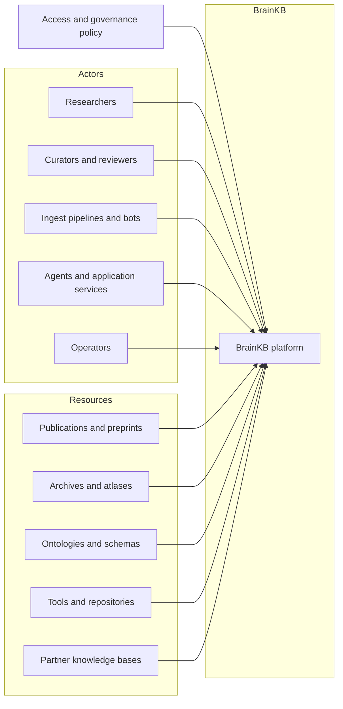

### L1 - System

Question answered: what can users and products do with BrainKB?

L1 shows BrainKB as a single system — its product workflows and the interface it exposes. Internal decomposition is not shown here; that belongs at L2.

Product capabilities:

- Evidence review: entity search/detail, claim comparison, conflict/silence states, provenance drilldown.
- Curation: candidate claim review, structured edits, batch publish request, validation report review.
- Release administration: graph release visibility, activation status, rollback target, projection readiness.
- Research workspace: saved searches, collections, task context, and explicit memory controls.
- Grounded assistant: plain-language queries with cited graph answers.

Out of scope at L1:

- Internal services, stores, deployment choices, and schema details.

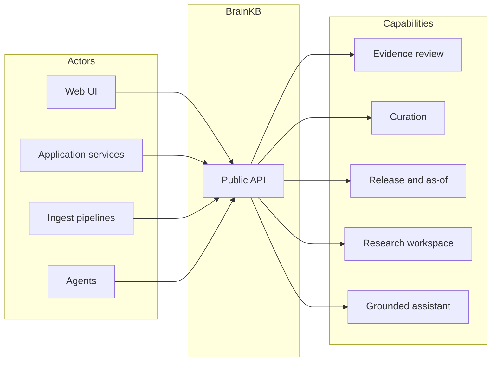

### L2 - Containers

Question answered: what are the tiers and how do dependencies flow?

BrainKB is organized in five tiers with dependencies flowing strictly downward.

- **Frontend** — web UI and researcher/curator surfaces
- **Application services** — use-case packages built on top of core (structsense, knowledgesynth, prisma-review)
- **Core services** — the shared platform:
  - `kg-api` — graph reads, writes, SPARQL queries, SHACL validation, named graph management
  - `ingest-api` — ingest submission, manifest handling, source registration, release lifecycle
  - `jobs-api` — async job queue for long-running operations (ingest, validation, projection build, LLM extraction); exposes job status, progress, cancellation, and activation control
  - `connector-api` — credential isolation, rate limiting, retry policy, and orchestration of all outbound calls to external services
  - `auth-api` — OAuth2/JWT issuance, scope enforcement, user and session management
- **Storage** — RDF triplestore, relational/vector store, object storage
- **External services** — reached only through the connector layer: LLM APIs, federated KBs, parsers, ontology services

Dependency rules:

- Frontend calls core and application services directly — no gateway layer.
- Application services compose core services — never call externals directly.
- Only core services touch storage.
- All outbound calls to external services go through the connector layer.

Out of scope at L2:

- Specific service names, ports, and workflow internals — those belong at L3.

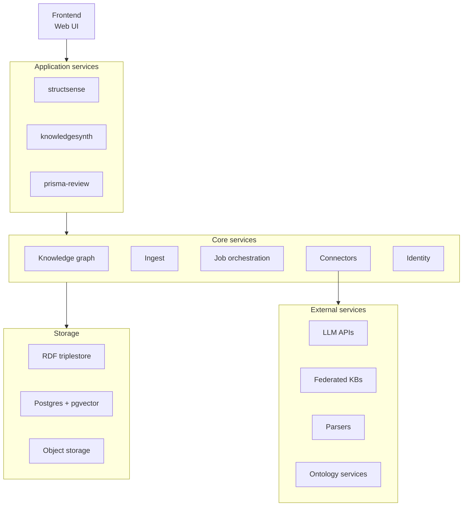

### L3 - Service Dependencies

**TODO: Tek will create a content**

Question answered: what are the dependencies between services, and what breaks if a service goes down?

> **Diagram pending.** This section will contain a richer version of the L2 diagram with explicit dependency edges between services — showing, for example, which services depend on auth-api, which depend on kg-api, and what is affected if any one service fails.

Out of scope at L3:

- Deployment topology and data model internals.

### L4 - Deployment

**TODO: Tek will create a content**

Question answered: what does the system look like when running, and how does it differ across environments?

> **Diagram pending.** This section will show the deployment view in two configurations: local development (Docker Compose, single host) and cloud (AWS). It will map services to hosts, volumes, and network boundaries.

Out of scope at L4:

- Data model internals and sequence flows.

### L5 - Knowledge/Data Model

**TODO: We will focus on this part later**

Question answered: what data model makes trust and evolution possible?

- **Identity** — stable, dereferenceable IRIs anchor every entity; typed against domain vocabularies (BICAN, openMINDS, NIMP).
- **Claim bundles** — qualified assertions carrying confidence scores, qualifiers, and a review lifecycle state.
- **Evidence and provenance** — each evidence node is backed by a PROV-O activity/agent/source chain.
- **Named graphs** — one graph per source/release/contribution; the unit of versioning and atomic replacement.
- **Release manifests** — immutable snapshots with checksum, transform digest, and validation report; each release exposes a projection contract and a derived/workflow-state contract with canonical back-pointers to source claims.
- **Application profile** — LinkML shapes, biolink categories, and reference ontologies constrain both claims and named graphs.

Contracts governing how read models and derived indexes must preserve these properties are in the Contracts section.

Out of scope at L5:

- UI layouts, product grouping, and container deployment diagrams.

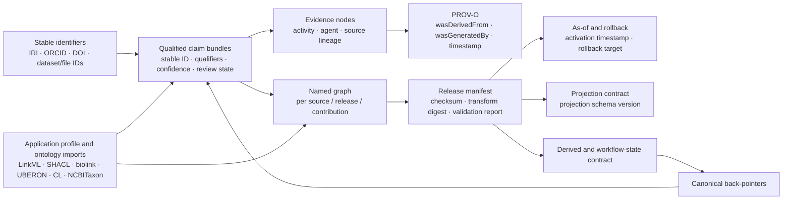

## Key Sequence Flows

**TODO: should be updated after the L3 and L4 is updated**

These diagrams show the service-level detail for the main workflows — each flow traced step-by-step across the actual services from the L2 architecture. They serve as contractual use cases: an implementation is correct when its runtime behaviour matches these sequences.

### Seq 1 — User Search Query

Frontend resolves a page config, mints a service JWT, then issues a SPARQL SELECT against kg-api.

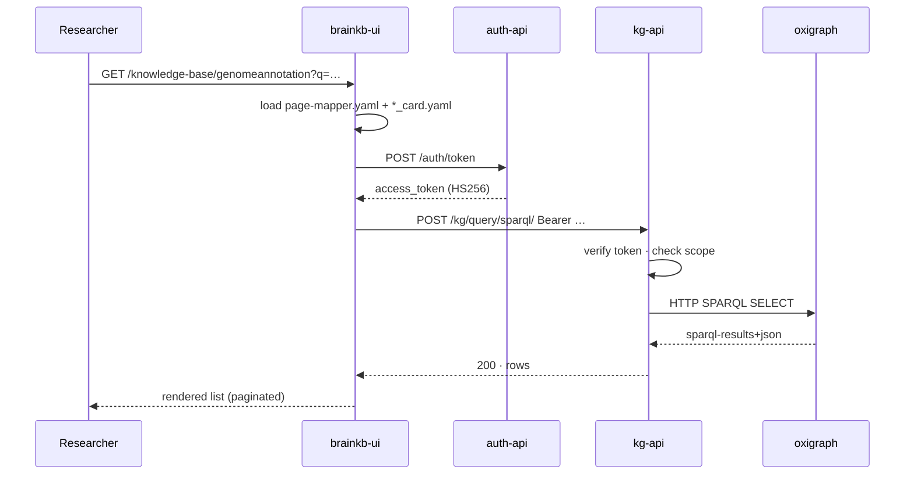

### Seq 2 — Data Ingestion Pipeline

External pipelines push validated RDF; kg-api validates, stages, and inserts into a per-source named graph.

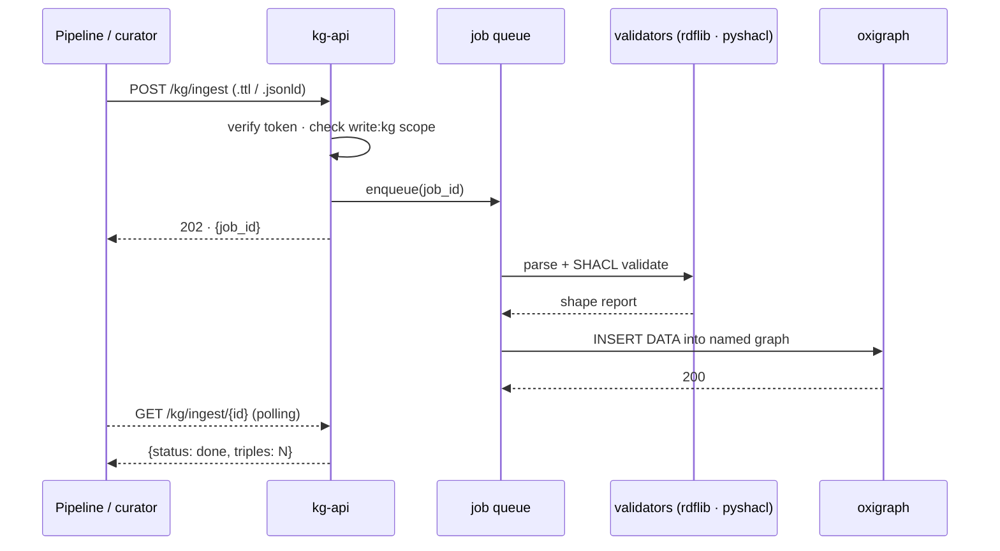

### Seq 3 — Entity Detail and Traversal

A detail page is a stack of templated CONSTRUCT queries — one per box, plus optional outbound dereference of linked IRIs.

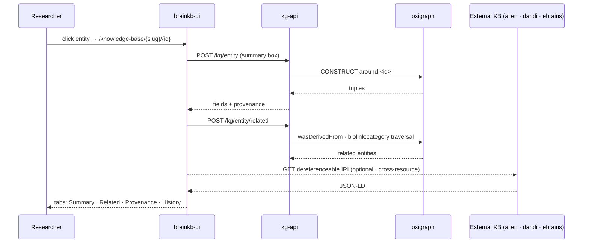

### Seq 4 — Authentication and Authorization

NextAuth handles human identity; auth-api mints service JWTs. Every protected endpoint verifies the shared HS256 secret and checks the embedded scope claim.

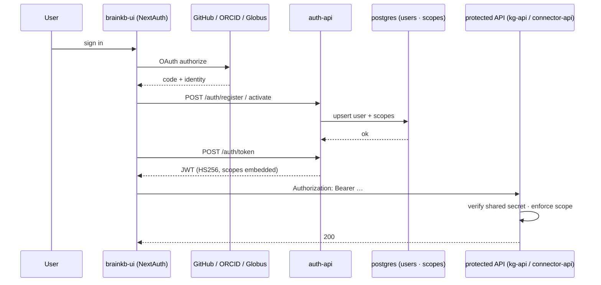

### Seq 5 — Cross-Resource Federated Query

SPARQL SERVICE clauses fan out to RDF-native KBs; REST adapters lift JSON resources into ephemeral triples.

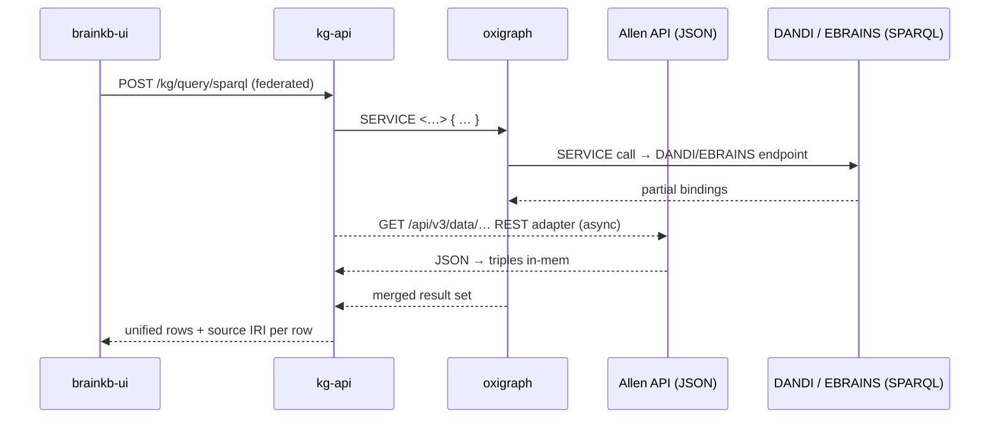

### Seq 6 — Curator Extract, Review, and Publish

structsense streams candidate extractions over WebSocket; the curator approves, then approved RDF lands in oxigraph through the standard ingest path. Drafts live in postgres so review state survives across sessions.

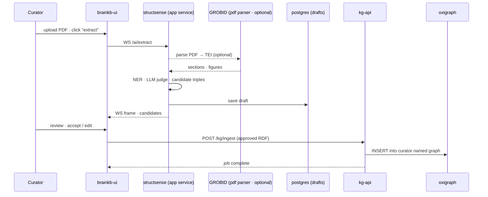

### Seq 7 — LLM-Assisted Query (RAG over the KG)

Retrieval is grounded in IRIs from pgvector; SPARQL hydration ensures every answer is backed by triples — citations are real graph nodes.

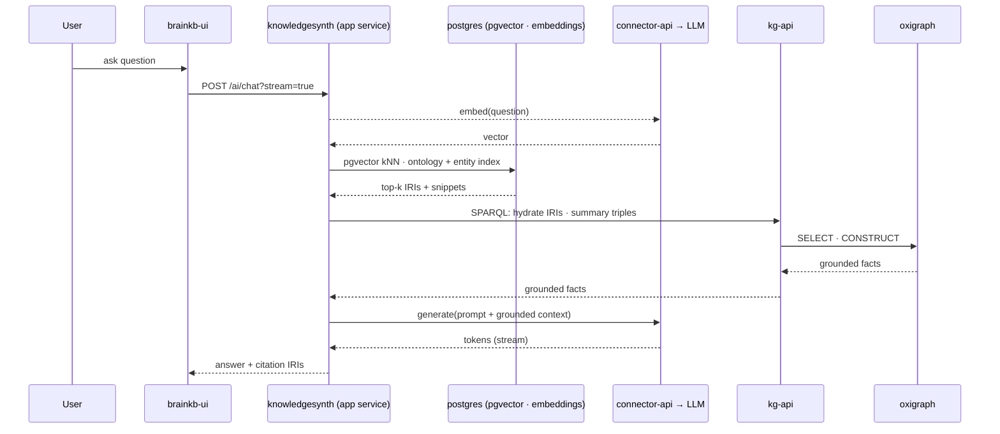

---

# Part 3 · MVP

## MVP Competency Fixture

Purpose: prove that BrainKB can answer a bounded neuroscience evidence-review question with enough concrete data to expose identity, provenance, versioning, source disagreement, projection behavior, file-level lineage, literature-derived claims, and reusable platform services.

Primary competency question:

> For a basal ganglia taxonomy atlas class, Patch-seq cell, gene, gene set, or related preprint, can BrainKB show the taxonomy assignment, BICAN model/release context, h5ad/source assets, gene and gene-set evidence, Patch-seq cell IDs, file-level archive artifacts, related publications, people, resources, claims, estimated analysis graphs, support/conflict/silence states, and graph version as of a selected date?

BG integration fixture scope:

- Atlas and taxonomy package:
  - Use the ABC Atlas / Human-Mammalian Brain Atlas Basal Ganglia package as the running seed resource.
  - Capture the BICAN model or application profile used by the atlas package.
  - Represent taxonomy release/version, class IDs, labels, aliases, hierarchy, crosswalks, species, anatomical region, assay/modality, and lifecycle state.
  - Preserve links to h5ad assets, expression matrices, metadata tables, spatial assets, gene expression matrices, marker genes, gene sets, and Patch-seq component references.
- Cell and specimen identity:
  - Represent gene names with stable gene identifiers and explicit source vocabulary/version.
  - Represent Patch-seq cell IDs, specimen IDs, taxonomy assignments, mapping method, mapping confidence, and quality-control state.
  - Resolve associated archive assets at file/asset level when available, not only dataset-level metadata.
  - Store dataset ID, asset/path/file ID, checksum or version, modality, format such as NWB or h5ad, and cell/specimen-level linkage.
- Publication and claim network:
  - Represent bioRxiv/preprint/publication records where the taxonomy was created, described, reused, or cited.
  - Extract or curate people, organizations, affiliations, resource mentions, dataset/tool/atlas references, and relevant identifiers.
  - Represent claims and evidence from text, figures, tables, notebooks, and estimated analysis graphs as reviewable claim bundles.
  - Preserve support, conflict, "not stated", inferred, superseded, and replaced states with graph release/as-of context.
- Reusable platform and tooling:
  - Build the fixture with adapters and transforms that are reusable outside BG: ABC Atlas adapter, h5ad metadata extractor, gene/gene-set resolver, Patch-seq cell mapper, DANDI/BIL/NeMO-style asset resolver, publication/NER/claim extractor, analysis-graph/evidence packager, provenance exporter, release manifest builder, projection parity checks, cache invalidation, and memory revalidation.
  - Treat BG as an integration test for shared platform capabilities, not as a one-off hardcoded demo.

Competency tasks:

- Given a BG taxonomy class, show marker genes/gene sets, species/region/modality qualifiers, BICAN model/release context, h5ad cells/assets, Patch-seq cells, source publications, and evidence state.
- Given a Patch-seq cell ID, show taxonomy class assignment, mapping method/confidence, source h5ad or NWB/file assets, archive asset links, related publications, and evidence graph.
- Given a gene or gene set, show related BG taxonomy classes, marker/evidence claims, source assets, source releases, and conflict/silence states.
- Given a paper or preprint, show detected people, organizations, resources, datasets, tools, atlas mentions, claims, source fragments, figures/tables when available, and links to taxonomy/assets.
- Given an as-of date, show which taxonomy classes, assets, claims, publications, mappings, and release manifests were active, superseded, deprecated, or unavailable.

Required graph object types:

- `TaxonomyRelease`, `TaxonClass`, `Cell`, `Specimen`, `Gene`, `GeneSet`, `Dataset`, `FileAsset`, `Publication`, `Preprint`, `Person`, `Organization`, `Resource`, `Claim`, `Evidence`, `AnalysisGraph`, `Notebook`, `WorkflowRun`, `ModelProfile`, `IdentifierMapping`, and `ReleaseManifest`.

Researcher success criterion:

- A neuroscientist can start from a BG taxonomy class, Patch-seq cell ID, gene/gene set, file asset, or bioRxiv/preprint record and reach taxonomy context, supporting evidence, source files, people/resources/claims, and release/as-of state in less than five minutes.

## MVP Scope

The MVP should be framed as a trustable evidence-review and ingest slice, not a broad discovery assistant.

MVP capabilities:

- Search by label, synonym, identifier, and fixture-specific source accession.
- Entity detail pages with source-attributed properties and evidence badges.
- Claim-level provenance drilldown with source, contributor, activity, graph, schema, release, and lifecycle state.
- Curated claim ingest from fixture data or manually authored paper-derived claims.
- Named graph release creation, validation, projection readiness, activation, and rollback.
- Optional GraphQL/Postgres projections for high-traffic read views, provided parity checks against canonical RDF pass.
- Local/self-hosted demonstration with reproducible fixtures and external services disabled, mocked, or clearly marked optional.

Post-MVP or gated capabilities:

- Hypothesis generation over broad neuroscience knowledge.
- Grounded assistant answers beyond the seeded fixture.
- General cross-KB federation across heterogeneous live sources.
- Automated ingestion from many partner release practices.
- Evidence-strength scoring across heterogeneous claims at production scale.
- Broad methods/models recommendation beyond a small structured catalog.

Hypothesis and assistant guardrails (apply beyond MVP):

- Initial outputs should be framed as candidate gap surfacing, triage, or evidence expansion, not discovery of new biological facts.
- The system should expose sparse-graph bias, literature-retrieval bias, ontology-mapping uncertainty, correlation-versus-mechanism limits, and species/modality transfer risk.
- A generated suggestion should not be written to the canonical graph without curator or reviewer action.
- If local evidence coverage is low, the product should fall back to search, external evidence expansion, or "insufficient evidence" rather than over-answering.

---

# Part 4 · Contracts

**TODO: we should not only review but think what other contracts are important to us. 
These contracts should be enough specific that claude can use to use for implementation.**

Contracts define the non-negotiable behaviors that BrainKB must satisfy across all services, releases, and integrations. They are not implementation recipes — they are the commitments that engineering decisions must preserve.

## Identifier Governance Contract

BrainKB needs explicit identifier governance because almost every epic depends on stable identity and explainable cross-resource alignment.

MVP fixture identifier rules:

- Every seed entity must have a canonical BrainKB IRI before review.
- Every seed entity should carry at least one resolvable external identifier or source-specific accession when one exists.
- Placeholder identifiers may be used only in internal fixture drafts; they must not appear in production as if they were real external IDs.
- Cross-resource equivalence must state its relation type: exact match, close match, broad/narrow match, related match, or unresolved candidate.
- Patch-seq cell/specimen IDs and file assets must remain queryable as first-class identifiers, even when the public-facing question starts from a taxonomy class, gene, or paper.

Canonical IRI policy:

- BrainKB may mint canonical IRIs for platform-owned entities, claims, graph releases, activities, and fixture records.
- Canonical IRIs should follow stable, documented patterns by entity class; generated IDs must not encode mutable labels.
- Source-specific identifiers must be preserved as cross-references, not discarded after canonicalization.
- The resolver should return labels, type, lifecycle state, equivalent identifiers, graph/release context, and deprecation or supersession metadata.

Equivalence policy:

- Use `owl:sameAs` only for very strong identity equivalence.
- Prefer SKOS-style mapping relations for most cross-resource alignments: exact match, close match, broad match, narrow match, related match, and candidate match.
- Each xref or mapping must have provenance: source, method, contributor or service, date, confidence, and graph/release context.

Merge, split, and deprecation policy:

- Merges should create explicit replacement edges and preserve old IRIs as resolvable deprecated identifiers.
- Splits should preserve the historical entity and point to replacement entities with rationale.
- Deprecated or superseded identifiers must remain queryable for as-of and provenance workflows.
- Projections must carry canonical IRI, source xrefs, mapping confidence, and lifecycle state so UI reads do not hide identity uncertainty.

## Claim And Provenance Contract

The unit of knowledge should not be an unqualified triple. BrainKB should represent each user-visible assertion as a qualified claim bundle.

Claim fields:

| Field | Required meaning |
| --- | --- |
| `claim_id` | Stable claim identifier exposed in RDF and projections. |
| `subject_iri` | Canonical BrainKB entity IRI. |
| `predicate_iri` | Predicate from the application profile. |
| `object_iri_or_value` | Object entity IRI or literal value. |
| `species_id` | Taxon identifier, such as `NCBITaxon:10090` or `NCBITaxon:9606`. |
| `region_id` | Anatomical region identifier when available. |
| `assay_or_modality` | Experimental modality or assay context. |
| `source_id` | Publication, dataset, release, or upstream resource identifier. |
| `evidence_id` | Evidence node or source fragment backing the claim. |
| `provenance_activity` | How the claim was created: imported, extracted, inferred, curated, reviewed, activated, superseded, or withdrawn. |
| `agent` | Who or what created the claim: curator, reviewer, service principal, extraction model, or transform job. |
| `support_state` | Supported, conflicting, refuted, not stated, inferred, or pending review. |
| `evidence_grade` | Lightweight confidence/evidence-strength label, not a claim of scientific certainty. |
| `graph_uri` | Named graph containing the claim. |
| `release_id` | Immutable graph release identifier. |
| `as_of` | Date or timestamp used for as-of query behavior. |
| `lifecycle_state` | Draft, active, superseded, deprecated, or withdrawn. |

Modeling direction:

- Use named graphs to preserve source/release/contribution boundaries.
- Consider a nanopublication-like or RDF-star-compatible representation for qualified statements, but do not require the deck to choose syntax before modeling requirements are agreed.
- PROV-O should express activity, agent, entity, derivation, generation time, and source lineage.
- SHACL or equivalent validation should enforce required provenance fields before activation.
- Updates must create new versions or supersession edges; silent in-place edits are not permitted.

Evidence UX constraint:

- Default views should first answer: what is the claim, what supports/refutes it, which paper/dataset/release says so, which species/region/modality applies, and whether the assertion is curated, imported, inferred, extracted, or superseded.
- Full PROV-O lineage should be one drilldown away, not the first thing a scientist must parse.

## Graph Release And Projection Contract

Automated ingest and GraphQL/Postgres projections require a release contract that makes activation observable and reversible.

Release manifest requirements:

- Immutable `release_id`.
- Named graph URI or graph set URI.
- Source resource, upstream release identifier, source checksum, and retrieved-at timestamp.
- Transform code version, container digest or workflow digest, and configuration hash.
- Application profile/schema version and validation report pointer.
- Graph diff pointer against the previous active release.
- Projection schema version and projection validation report.
- Activation timestamp, activated-by agent, previous active release, and rollback target.
- External dependencies and connector versions used during build.

Activation rule:

- The active release pointer changes only after graph validation, projection build, projection parity checks, and readiness checks pass.
- From the user's perspective, RDF reads and GraphQL/Postgres projection reads must expose the same active release or clearly report a stale/unready projection state.
- If projection readiness fails, the previous active release remains visible and the failed release remains inspectable.

Ingest and activation state machine:

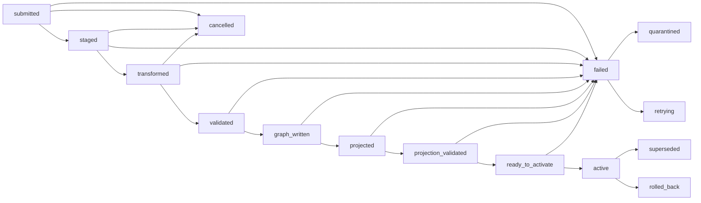

Projection parity requirements:

- GraphQL objects and Postgres read models must expose canonical IRI, claim ID, graph URI, release ID, schema version, evidence links, lifecycle/as-of state, and projection freshness.
- Parity tests should compare a small set of canonical RDF/SPARQL answers against GraphQL/Postgres responses for the fixture competency questions.
- Projection schema evolution must be versioned and tied to release manifests.

## Operational Readiness Contract

This contract makes deployability and operations reviewable rather than leaving them as implied implementation detail.

Deployment targets:

- Local fixture mode: Docker Compose or equivalent local stack with Oxigraph, Postgres, Redis if needed, seed fixtures, mocked connectors, disabled or stubbed LLM calls, and deterministic rebuild.
- Self-hosted mode: documented volumes, migrations, secrets, TLS/proxy expectations, backup locations, and upgrade path.
- Production mode: Kubernetes or equivalent deployment with health checks, readiness checks, persistent volumes, service accounts, and controlled activation jobs.

Ingest/job requirements:

- Jobs expose state, progress, current phase, input manifest, validation report, retry count, cancellation state, activation readiness, projection freshness, and final release ID.
- Long-running jobs support cancellation before activation.
- Backpressure and queue depth should be visible so partner releases or extraction jobs do not overwhelm the system.

Observability requirements:

- Metrics: ingest duration, validation failure rate, queue depth, projection lag, activation failures, stale reads, cache hit/miss/stale rates, cache invalidation failures, memory promotion/rejection counts, embedding freshness, connector latency/error rate, external rate-limit hits, LLM call count/cost/error rate, auth failures, backup freshness, and restore-test age.
- Logs: request ID, job ID, release ID, graph URI, actor/service principal, connector name, upstream source, and error category.
- Traces: each service (`kg-api`, `ingest-api`, `jobs-api`, `connector-api`, `auth-api`) is a trace root for its own operations; `brainkb-ui` is the trace root for browser-initiated workflows. All spans propagate request ID, user/session/project, release/as-of context, job ID, projection freshness, cache status, partial-result status, and downstream service/module spans for ingest, projection, cache lookup/fill/invalidation, memory read/write/promotion, search, provenance lookup, federation, and assistant retrieval.
- SLO candidates: read availability, search latency, cache freshness, memory retrieval latency, projection lag after activation, ingest success rate for fixture packages, and restore time.

Auth and scope matrix:

| Role | Read | Draft | Validate | Activate | Administer | External calls |
| --- | --- | --- | --- | --- | --- | --- |
| Anonymous reader | Public graph only | No | No | No | No | No |
| Authenticated researcher | Public and permitted graphs | Saved collections only | No | No | No | Optional, user-scoped |
| Curator | Permitted graphs | Yes | Yes | No | No | Via approved connectors |
| Reviewer | Permitted graphs | Yes | Yes | Approve within scope | No | Via approved connectors |
| Service principal | Scoped graph/package access | Yes | Yes | Scoped activation | No | Scoped, audited |
| Admin | All | Yes | Yes | Yes | Yes | Yes, audited |
| Connector operator | Operational metadata | No | No | No | Connector config only | Yes, audited |

Browser-facing auth rule:

- `brainkb-ui` authenticates directly with `auth-api`. Each service verifies the JWT independently using the shared HS256 secret and enforces its own scope requirements.

Backup and restore:

- Define RPO/RTO targets before production implementation.
- Back up Postgres, triplestore/named graph snapshots, release manifests, validation reports, durable connector caches, project/task memory, vector indexes or their rebuild manifests, and object/artifact storage.
- Treat Redis or queue state as non-durable unless configured otherwise.
- Run restore drills using the basal ganglia fixture and at least one superseded release.
- Preserve rollback targets for active graph releases.

External service boundaries:

- Connectors own credentials, rate limits, caching, attribution, retry policy, privacy/data-egress checks, and outage behavior.
- The UI should distinguish local evidence, cached external evidence, live external evidence, memory-derived context, and unavailable sources.
- External failures should produce partial-result states where appropriate, not silent empty answers.

## Ontology Alignment And FAIR Contract

Ontology and schema alignment should be a named workstream, not a hidden data-cleaning task.

Vocabulary layer stack:

BrainKB uses a layered vocabulary model rather than a single ontology. Each layer answers a different alignment question:

| Layer | Vocabularies | Role |
| --- | --- | --- |
| Upper | biolink-model | Entity categories: Gene, Disease, AnatomicalEntity, … |
| Domain | BICAN · openMINDS · NIMP | Cell taxonomies, experiments, datasets |
| Standards | BIDS · NWB · LinkML | Data structure and metadata schemas |
| Provenance | PROV-O | `wasDerivedFrom` · `wasGeneratedBy` · Agent |
| Reference | UBERON · CL · NCBITaxon | Anatomy, cell types, species |
| Identity | IRIs · ORCID · DOI | Stable, dereferenceable identifiers |

Application profile:

- Define the minimal BrainKB application profile for the MVP fixture: entity classes, predicates, claim qualifiers, provenance fields, release fields, and validation shapes.
- Express the application profile as LinkML schemas and SHACL shapes; apply `rdflib` and `pyshacl` during ingestion validation.
- Version the application profile and tie each graph release to the profile version used for validation.

Ontology import and alignment:

- State which versions of BICAN, openMINDS, NIMP, BIDS, NWB, UBERON, CL, NCBITaxon, biolink, and other vocabularies are imported or referenced.
- Express crosswalk mappings using SKOS equivalence relations (`skos:exactMatch`, `skos:closeMatch`, `skos:broadMatch`); preserve mapping confidence, method, and lifecycle as named-graph provenance.
- Validate term usage across the MVP fixture before presenting a claim as active.
- Track term deprecation, replacement, and unresolved mapping candidates.

FAIR and export metadata:

- Each graph release must include machine-readable metadata covering citation, license/access constraints, source attribution, schema/profile version, checksums, and provenance.
- Export packages must conform to at least one structured metadata standard: RO-Crate, DataCite, or schema.org. Choose before the first public release and version the choice.
- Exportable snapshots must include enough manifest and provenance metadata to reproduce the fixture review without relying on hidden local state.

---

# Part 5 · Strategy

## Store And Query Strategy

RDF is the lingua franca for knowledge; everything else lives in Postgres. The query layer hides the seam.

Polyglot persistence:

| Engine | Query | Role |
| --- | --- | --- |
| Oxigraph (RDF/named graphs) | SPARQL | Canonical knowledge store: claims, provenance, federation, versioning, named-graph-per-source |
| Postgres + pgvector | SQL + vector kNN | Users, scopes, jobs, ingest state, operational metadata; embeddings and read projections |
| Local filesystem | files | TTL/JSON-LD/RDF dumps, PDF uploads, Oxigraph data directory |

Baseline decision:

- RDF/named graphs are the canonical model for claims, provenance, source boundaries, versioning, and federation semantics.
- `brainkb-ui` calls services directly; each service owns its own auth enforcement, release/as-of context, and API contract.
- `kg-api` owns writes, validation, and canonical query semantics regardless of the backing triplestore implementation.
- Postgres already stores operational state; it may also hold denormalized read models for common entity, evidence, search, dashboard, task-memory, and agent-memory views.
- Caches and memory stores improve performance and workflow continuity, but they do not become canonical knowledge unless a reviewed promotion writes through the standard claim/provenance path.
- `brainkb-ui` and browser-based agents should call only the public API surface; they should not call graph, ingest, job, cache, memory, connector, or store APIs directly.

GraphQL/Postgres variant:

- Add a GraphQL read mode on the public API surface, or as a dedicated module behind it, backed by Postgres tables or materialized projections derived from canonical RDF/named graphs.
- Use GraphQL for high-traffic UI patterns that are awkward or slow to express directly as SPARQL: entity detail pages, nested evidence views, faceted search, timelines, review queues, and dashboard summaries.
- Keep SPARQL/RDF available for graph-native queries, federation, provenance audits, schema/version operations, and expert workflows.
- Treat GraphQL objects as read models with explicit semantics, not as a second source of truth.
- Expose canonical IRI, claim ID, graph URI, release ID, schema/profile version, evidence links, lifecycle/as-of state, and projection freshness on relevant GraphQL objects.

Service design implications:

- The triplestore plus an optional GraphQL/Postgres read projection is a deliberate performance boundary, not an accidental duplicate source of truth.
- Projection and cache semantics that must survive any read path: provenance, versioning, named graph membership, identifier stability, auth scope, and release context.
- Sync rules and projection lifecycle requirements are defined in the Graph Release And Projection Contract.

## API Boundary And Service Decomposition

The architectural boundary matters more than the initial packaging. BrainKB can preserve its trust contracts with separate services without exposing all of them directly to the browser.

Service topology:

| Service | Browser-facing | Role |
| --- | --- | --- |
| `kg-api` | Yes | Graph reads, writes, validation, canonical SPARQL queries |
| `ingest-api` | Yes | Ingest submission, manifest handling, source registration |
| `jobs-api` | Yes | Job status, progress, cancellation, activation control |
| `connector-api` | No | Credential isolation, rate limiting, connector orchestration — called by core services only |
| `auth-api` | Yes | OAuth2/JWT issuance, scope enforcement, session management |
| `brainkb-ui` | Yes | Browser client; calls services directly |

Decomposition rationale:

- `brainkb-ui` calls services directly — there is no gateway or BFF layer. This is the same pattern as DANDI.
- Each service owns its own boundary: credentials, scaling, failure domain, and deployment lifecycle are independent.
- Services that should never be directly browser-facing: triplestore, Postgres/pgvector, Redis, object storage, cache internals, memory stores, and external LLM/search/archive endpoints.
- Long-running operations (ingest, validation, projection build) are handled asynchronously via job queues — the UI submits and polls rather than waiting on a synchronous response.
- A service earns a separate deployable when credential isolation, rate limiting, ownership, or failure domain requires it — not because it has a name.
- Long-running operations (ingest, validation, projection build, LLM extraction) are handled asynchronously via job queues or pub-sub events — the UI or pipeline submits and polls rather than holding a synchronous connection open.

## Cache And Agent Memory Strategy

BrainKB should treat caching and agent memory as related but distinct platform capabilities. Cache is a performance and resilience boundary. Memory is workflow state for researchers and agents. Neither should silently create facts in the canonical graph.

Cache service:

- The cache module (split later as `cache-api` only if needed) provides a deterministic cache facade for entity hydration, provenance lookup, release readiness, connector responses, federated subquery results, search facets, and expensive LLM/tool-call intermediates.
- Cache keys should encode: release and schema version, source/resource identity, query template version, auth scope, and tenant/project. This ensures cache entries are never silently shared across releases or permission boundaries.
- Cache entries should expose status metadata (hit, miss, stale, negative cache) and enough provenance (source timestamp, TTL, invalidation reason) for the UI to distinguish live results from cached ones.
- Graph release activation should namespace or invalidate cache entries by release and schema version rather than mutating old results in place.
- Redis backs hot short-TTL cache; Postgres or object storage backs durable connector/result caches where replay, rate-limit protection, or offline review matter.
- Cache health (misses, stale reads, invalidation failures, upstream retry behavior) should be observable.

Agent memory components:

- Ephemeral working memory: current conversation/task context, selected entities, active filters, retrieved evidence, tool results, and UI state. It is user/session scoped, short TTL, resumable within a session, and discarded unless promoted.
- Short-term task memory: active research workspace with query plans, candidate hypotheses, scratch collections, rejected suggestions, retrieval traces, and partial review state. It is user/project scoped, expires or archives, and can support multi-step agent work.
- Long-term project/user memory: saved collections, reviewed claims, reusable query templates, trusted-source preferences, vocabulary choices, researcher goals, and explicit "remember this" notes. It requires user-visible control and should be exportable.
- Institutional/platform memory: curated ontology mappings, release validation outcomes, connector reliability history, benchmark results, answer-quality evaluations, and reusable workflow templates. It is admin or reviewer governed.
- Semantic/vector memory: embeddings for entities, claims, papers, datasets, tools, workflows, and memory items. Vector entries are derived indexes that must point back to canonical IDs, evidence, release context, and embedding model version.
- Provenance/audit memory: prompts, model/provider metadata, tool calls, retrieval sets, source snippets, generated drafts, and reviewer decisions when they influence user-visible answers or candidate claims.

Memory lifecycle and promotion rules:

- The memory module, exposed internally and split later as `memory-api` only if needed, owns memory reads, writes, retention, promotion, and deletion; UI code and agents should not write directly to store tables.
- Every memory item should carry enough metadata to answer: who owns it, what scope it belongs to, where it came from, when it expires, which graph release it was valid for, and what privacy/auth policy applies.
- Promotion path is explicit: ephemeral memory can become task memory; task memory can become project memory; project memory can propose candidate claims; candidate claims enter the canonical graph only through review, validation, named graph write, and release activation.
- Memory can bias retrieval and workflow continuity, but it cannot replace evidence. Agent answers must cite canonical entities, claims, papers, datasets, or explicitly labeled external results.
- Stale memory must be revalidated when graph releases, ontology mappings, projection schemas, or connector versions change.
- Private user/project memory must not be used as institutional memory or model-training/evaluation input without explicit policy and consent.

---

# Part 6 · Epics and Traceability

## Epic User Stories

Each story follows the same template so it can be turned into issues or implementation slices without reinterpreting intent. Each epic has four sections:

- **Preconditions** — what must be true before the epic can be implemented.
- **Acceptance criteria** — what must be true for the epic to be considered done.
- **Implementation sequencing** — the recommended order to build the pieces.

All items are assumed to be in scope for the first release unless marked otherwise:

- `[Future]` — desired but deferred beyond the first release.

Epics:

1. [Entity Exploration and Knowledge Review](#epic-01---entity-exploration-and-knowledge-review)
2. [Resources Catalog](#epic-02---resources-catalog)
3. [Curation Workflow](#epic-03---curation-workflow)
4. [Hypothesis Testing and Generation](#epic-04---hypothesis-testing-and-generation)
5. [Grounded Assistant / MCP Interface](#epic-05---grounded-assistant--mcp-interface)
6. [Automated Ingestion Pipeline](#epic-06---automated-ingestion-pipeline)
7. [Cross-KB Federated Query](#epic-07---cross-kb-federated-query)
8. [Neuroscience Abstract Atlas](#epic-08---neuroscience-abstract-atlas)

### Epic 01 - Entity Exploration and Knowledge Review

**Actor:** researcher or reviewer

**Goal:** search for any entity (cell type, dataset, region, paper, method, claim) and see the full connected picture, including agreement and conflict across sources.

**Value:** read-only exploration works without requiring users to know SPARQL, RDF, or source-specific identifiers; logged-in users can evaluate the field's state of knowledge without flattening contradictory evidence into a single asserted fact.

**Trigger:** a user enters a name, synonym, or identifier; or opens a property and asks "what do we know about this?" Natural-language phrase search is a future trigger once semantic search is available.

**Preconditions:**

- Entities have stable identifiers or resolvable cross-references.
- Entity type schemas are defined for each supported entity type.
- A seed entity set is ingested from the BG taxonomy atlas, including taxonomy classes, gene/genome data, library generation data following BICAN LinkML models.
- A seed set of claims and papers is ingested.
- Entities are stored with source, contributor, timestamp, and schema version.
- Named graphs (or other storage types) preserve source boundaries.
- Search indexes cover labels, synonyms, and identifiers.
- [Future] Search indexes cover claim text.
- [Future] Authentication and authorization are available for identity-gated features.
- [Future] External links and federated attributes are clearly attributed.

**Acceptance criteria:**

- Search resolves synonyms and cross-references to canonical entity pages.
- Read-only exploration works without login.
- [Future] Logged-in users can save searches or collections.
- Entity pages exist for taxonomy classes, Patch-seq cells/specimens, genes, gene sets, file assets, datasets, papers/preprints, resources, claims, and evidence.
- Entity pages display the identifier, name, and properties according to the entity type schema (e.g., related entities, source links, file-level assets, and any type-specific fields).
- Assertions are grouped so users can compare values across sources; conflicting claims are visible together, not silently collapsed.
- Each claim surfaces its provenance.
- [Future] Users can filter or compare by source, version, and as-of date.

**Implementation sequencing:**

1. Build label, synonym, and identifier search.
2. Build single-source entity pages and allow cross-references between entities.
3. Curate overlapping claims across at least two sources and build the multi-source conflict view to demonstrate agreement, disagreement, and "not stated" states.
4. [Future] Add claim-text search to the search index.
5. [Future] Assign defensible evidence-strength scores across heterogeneous sources.
6. [Future] Expand ingestion to cover a full connected picture across modalities and species.

### Epic 02 - Resources Catalog

Resources are tangible things with identifiers — datasets, tools, models, pipelines, archives, schemas, and ontologies. Concepts such as claims or hypotheses are not resources.

**Actor:** researcher

**Goal:** find datasets, tools, models, pipelines, and other neuroscience resources and understand their applicability and limitations.

**Value:** users can find and compare resources based on applicability, usage in similar tasks, benchmark evidence, and known limitations rather than manual literature search.

**Trigger:** a user searches for resources by type, task, modality, species, or topic.

**Preconditions:**

- Resource entity type schemas are defined (consistent with Epic 01).
- Resources are represented as first-class graph entities with stable identifiers.
- Applicability conditions and benchmark evidence are structured.
- [Future] Lifecycle states (active, superseded, deprecated, retired), version history, and as-of graph selection are supported.

**Acceptance criteria:**

- Users can search for resources by type, task, modality, species, or topic.
- Resource pages display identifier, name, and properties according to the entity type schema.
- Results show applicability conditions, benchmark evidence, failure modes, and source provenance.
- Tool versions, owners, inputs, and outputs are visible.
- [Future] Users can view resources by status, date, and version history; lifecycle states (active, superseded, deprecated, retired) and replacement relationships are visible.

**Implementation sequencing:**

1. Define entity type schemas for resource types and seed a catalog from known project resources (BICAN, ABC Atlas/HMBA-BG, DANDI, BIL, NeMO, Allen Brain Atlas, NeuroMorpho, EBRAINS, BIDS, NWB, openMINDS) with applicability conditions as structured metadata.
2. Add benchmark evidence, failure modes, and usage examples from papers and curated notes.
3. [Future] Add lifecycle metadata (active/superseded/deprecated/retired, version edges, replacement relations).
4. [Future] Implement as-of graph selection for versioned resources.
5. [Future] Keep the registry current with automated monitoring across independent resources.

### Epic 03 - Curation Workflow

**Actor:** curator

**Goal:** extract candidate claims and entities from a paper or preprint, review them, and publish approved content into the graph.

**Value:** experts can add structured knowledge without writing RDF by hand; the extract → review → publish cycle applies to any entity type and preserves full curator provenance.

**Trigger:** a curator uploads or references a publication and starts an extraction/review job.

**Preconditions:**

- Claim and entity type schemas are defined and validation paths exist.
- Review state can persist before publication.
- An ingest path is available for approved content for authenticated users.

**Acceptance criteria:**

- Curators can manually author candidate claims and entities from a publication.
- Candidates include source document, curator identity, and confidence.
- Curators can approve, edit, reject, or batch publish candidates.
- Approved content is written through an ingest path into a named graph tied to the source and curator.
- Automated extraction produces candidate claims and entities from uploaded documents; candidates include source offsets and model/prompt metadata.

**Implementation sequencing:**

1. Support manually authored candidate claims from BG taxonomy papers/preprints; store draft review state with links to source document and target graph/schema version.
2. Define a minimal claim schema and validation path so approved claims can be written consistently.
3. Integrate a PDF/text parser and entity extraction path with NER for people, organizations, resources, datasets, tools, genes, and cell classes.
4. [Future] Support extraction of claims from figures, tables, and notebooks (not just text), representing the source data as structured evidence nodes.

### Epic 04 - Hypothesis Testing and Generation

**Actor:** researcher

**Goal:** check whether a stated hypothesis is supported, contradicted, or unaddressed by graph evidence; surface candidate hypotheses from graph patterns and gaps.

**Value:** researchers can validate or challenge ideas against structured evidence without manual literature search; the graph structure reveals candidate connections worth investigating.

**Trigger:** a user states a hypothesis and asks what the evidence says, points to a specific publication to test against, or asks what graph patterns imply.

**Preconditions:**

- Entity exploration and claim evidence views are available (Epic 01).
- Hypotheses are representable as graph entities with stable identifiers and provenance.
- Claims can be queried for support, conflict, and absence against a given pattern.
- [Future] Similarity signals exist for entities, claims, and documents.
- [Future] Working state — query plans, rejected ideas, and candidate drafts — can be stored in session or task memory and promoted to the canonical graph only after curator review.

**Acceptance criteria:**

- Users can state a hypothesis and retrieve supporting, conflicting, and absent evidence from the graph.
- Users can provide a specific publication to test a hypothesis against, or search for all relevant publications in the graph.
- Hypotheses are labeled as candidates, not facts, and stored as graph entities with provenance.
- Users can save, reject, or send a hypothesis to curator review without committing it to the canonical graph.
- [Future] The system surfaces candidate hypotheses from graph structure, gaps, analogies, or marker/region similarity.
- [Future] Saved or rejected hypotheses are stored as task memory with release context and can be revalidated when the graph changes.

**Implementation sequencing:**

1. Represent hypotheses as first-class entities with stable identifiers, provenance, and lifecycle state (draft, active, rejected, superseded).
2. Build hypothesis testing: given a stated hypothesis, retrieve supporting, conflicting, and absent evidence from the graph; allow the user to pin a specific publication or search all relevant publications as the evidence scope.
3. [Future] Add candidate connection suggestions over the seed graph (shared markers, regions, missing evidence, source disagreement).
4. [Future] Populate entity embeddings and paper metadata to make similarity-based suggestions useful.
5. [Future] Integrate external discovery services as evidence expansion sources.

### Epic 05 - Grounded Assistant / MCP Interface

**Actor:** researcher, external agent or tool (via MCP)

**Goal:** expose BrainKB knowledge through an MCP-compatible interface so external agents and tools can query the graph; optionally provide a built-in assistant panel for direct plain-language questions grounded in graph evidence.

**Value:** any tool that speaks MCP can query BrainKB without bespoke integration; the optional built-in assistant demonstrates the same capability for researchers who prefer a chat interface.

**Trigger:** an external agent invokes an MCP endpoint, or a user asks a question in the assistant panel.

**Preconditions:**

- Entity lookup, SPARQL query, and claim retrieval are available through `kg-api`.
- [Future] LLM providers, semantic retrieval, and memory are available to support the built-in assistant.

**Acceptance criteria:**

- BrainKB exposes an MCP-compatible interface covering entity lookup, SPARQL query, and claim retrieval.
- [Future] Built-in assistant provides grounded answers with citations and an inspectable retrieval basis.

**Implementation sequencing:**

1. Define and expose an MCP-compatible interface for entity lookup and SPARQL queries over `kg-api`.
2. [Future] Build a built-in assistant panel with grounded answer synthesis, citations, and retrieval tracing.
3. [Future] Extend with memory, external source routing, and reliability improvements.

### Epic 06 - Automated Ingestion Pipeline

> Low priority — the implementation sequencing should be reviewed and refined when automated ingestion is being planned.

**Actor:** ingest pipeline, partner release bot, or service principal

**Goal:** monitor partner resources for new releases — datasets, models, preprints, taxonomies, schemas — and ingest them automatically, activating a new graph version without removing prior versions.

**Value:** BrainKB stays current with partner resources while preserving reproducibility and history.

**Trigger:** upstream release tag, scheduled job, webhook, or pub-sub event. Ingest is inherently asynchronous — the pipeline submits a job and polls for status.

**Preconditions:**

- Machine credentials and scoped write tokens exist.
- Incoming data can be validated before activation.
- Versioned graph URIs and supersession policy exist.

**Acceptance criteria:**

- Pipelines can submit idempotent ingest jobs through a headless API.
- New releases become active without deleting old releases.
- Failures leave the previous active graph untouched and produce actionable logs.
- [Future] Validation reports and graph diffs are available before activation.

**Implementation sequencing:**

1. [Future] Support file-based release ingest for the ABC Atlas/HMBA-BG package with each package declaring source, release ID, graph URI, and schema version.
2. [Future] Add validation reports, graph diffs, and projection sync checks to the job lifecycle.
3. [Future] Implement scoped service credentials for machine ingest.
4. [Future] Build automated polling/webhooks and transforms for multiple partner resources with different release practices.

### Epic 07 - Cross-KB Federated Query

> Low priority — external resources often lack working federation endpoints; implementation creates external dependencies. Target resources: DANDI, BBQS, ReproNim lakes/ponds. Review when federation with a specific partner is being planned.

**Actor:** researcher

**Goal:** ask one question whose answer spans local BrainKB knowledge and one or more external resources.

**Value:** users do not need to export and join data by hand; BrainKB handles query planning, source attribution, and partial results.

**Trigger:** a user searches for information that exists across BrainKB and an external resource.

**Preconditions:**

- Equivalent entities are mapped to canonical identifiers or cross-references.
- [Future] External resources expose SPARQL, REST, or adapter-accessible interfaces.

**Acceptance criteria:**

- [Future] Results reconcile by canonical URI and preserve per-result provenance.
- [Future] Slow or unavailable sources degrade gracefully with visible status.
- [Future] REST-backed resources can be lifted into temporary graph-like results through connectors.

**Implementation sequencing:**

1. [Future] Demonstrate federation with one stable external endpoint (e.g. DANDI or ABC Atlas metadata).
2. [Future] Align canonical identifiers across two or three real resources.
3. [Future] Add timeout, partial result, and stale cache behavior so external failures are visible.
4. [Future] Generalize query planning across heterogeneous SPARQL, REST, and file sources.

### Epic 08 - Neuroscience Abstract Atlas

The abstract atlas is a meta-scientific layer over publication corpora — papers, preprints, and conference abstracts — that complements the entity graph with a topical map of how the field is organized. It is informed by the [sensein/ohbm2026](https://github.com/sensein/ohbm2026) pipeline (conference-scale corpus, embeddings, UMAP, community-detection clusters, faceted UI) and by [Costa et al., *The Evolving Landscape of Neuroscience*](https://apertureneuro.org/article/156380-the-evolving-landscape-of-neuroscience) (field-scale longitudinal map of ~460k PubMed abstracts, contrastive-learned embedding space, Leiden clusters, citation overlays).

**Actor:** researcher

**Goal:** see where a paper, preprint, or claim sits in the topical landscape of a corpus, and discover active themes, emerging trends, and underrepresented gaps across the field.

**Value:** entity exploration (Epic 01) answers "what do we know about *this thing*"; the abstract atlas answers "what does the field *look like*". Cluster maps reveal active themes, cross-cluster relationships, and missing intersections that a per-entity view cannot expose, and ground the rest of BrainKB (search ranking, hypothesis suggestions, grounded answers) in the structure of the literature.

**Trigger:** a researcher opens a corpus landscape (a conference, a journal feed, or a curated set), drops in a query or a specific paper, or asks "what does the field look like here?" An external agent may also request cluster context for a paper or query via MCP.

**Preconditions:**

- A corpus of papers, preprints, or conference abstracts is ingested with stable identifiers (DOI, OpenAlex ID, or local IRI) and normalized title/abstract/section text.
- Author and institution metadata is reconciled against external IDs (ORCID, ROR) where available.
- Embedding generation is available with a configurable backend; embeddings are persisted with the corpus release.
- Dimensionality reduction (e.g., UMAP) and clustering (community-detection and k-means) run as offline workflows producing reproducible artifacts with checkpointed, resumable execution.
- Cluster outputs carry human-readable labels derived from member text and link back to canonical entity pages in the graph.
- [Future] Claim-level embeddings exist alongside abstract-level embeddings so multiple semantic lenses can be overlaid on the same corpus.
- [Future] Citation and cross-reference data (OpenAlex, PubMed) is available for inter-cluster relationship and influence analysis.
- [Future] Atlas artifacts are versioned with the underlying graph release so a landscape view can be reproduced as-of a given date.

**Acceptance criteria:**

- Researchers can browse an interactive 2D landscape projection of a corpus, colored by cluster, with hover, zoom, and select.
- Lexical and semantic search both work over the corpus and return results with their cluster assignments.
- Each paper, preprint, or abstract page shows its cluster assignment(s), nearest neighbors, and links into the entity graph (claims, datasets, authors).
- Cluster pages list member abstracts, top terms, and a human-readable cluster label.
- The corpus, embedding model, reduction parameters, and cluster artifacts are recorded in a release manifest so a landscape can be re-derived identically.
- [Future] Researchers can switch between semantic lenses (e.g., title+abstract embedding vs. claim-level embedding) over the same corpus.
- [Future] Longitudinal views surface cluster size, growth rate, and citation interactions over time.
- [Future] Gap analysis highlights underrepresented intersections (e.g., methodology × scale pairs that are absent or sparse).
- [Future] An MCP endpoint returns cluster lookups, nearest neighbors, and corpus coordinates so external tools and the grounded assistant can use landscape context.

**Implementation sequencing:**

1. Ingest a seed corpus — OHBM 2026 abstracts as the first fixture — with normalized title/abstract/section text, figures linked as evidence, and author/institution reconciliation against ORCID/ROR/OpenAlex.
2. Generate abstract-level embeddings via a configurable backend (e.g., MiniLM, OpenAI, Voyage) and persist them with the corpus release manifest.
3. Run UMAP plus community-detection (Leiden) and k-means clustering; produce labeled clusters and an interactive landscape view with lexical and semantic search, faceted browse, and cluster pages.
4. Link landscape entries back to the entity graph so claims, datasets, and authors discovered in BrainKB align with their landscape position.
5. [Future] Add claim-level extraction and a second semantic lens over the same corpus so atlases can be compared across lenses.
6. [Future] Extend ingestion to a longitudinal corpus (e.g., PubMed-derived neuroscience subset following the Aperture Neuro methodology) for field-scale trend and gap analysis.
7. [Future] Add citation network overlays, cluster-size time series, and gap analyses with as-of versioning tied to graph releases.
8. [Future] Expose the atlas through an MCP endpoint and feed cluster context into grounded-assistant retrieval so answers can cite a paper's topical neighborhood as well as its claims.

## Traceability Matrix

> **TODO:** Review "Primary architecture levels" for all epics once L3 (Service Dependencies), L4 (Deployment), and L5 (Knowledge/Data Model) diagrams are complete. L5 is currently missing from all rows and several assignments may need updating.

| Epic | Primary architecture levels | Sequence flows | Required platform capabilities |
| --- | --- | --- | --- |
| 01 Entity Exploration and Knowledge Review | L1, L3, L4 | Search, drill-down, provenance | Entity hydration, named graph aggregation, BG taxonomy/asset/claim traversal, conflict display, evidence scoring. |
| 02 Resources Catalog | L0, L1, L4 | Search, drill-down | Tool/model entities, applicability schema, benchmarks, failure-mode provenance. |
| 03 Curation Workflow | L1, L2, L3, L4 | Curator, ingest, auth | Document parsing, NER/extraction drafts, analysis-graph evidence, review queue, schema validation, named graph write. |
| 04 Hypothesis Testing and Generation | L1, L2, L3, L4 | Search, LLM-assisted query, memory promotion | Graph patterns, similarity retrieval, task memory, grounded suggestions, reviewable drafts. |
| 05 Grounded Assistant / MCP Interface | L1, L2, L3, L4 | LLM-assisted query, search, memory retrieval | MCP interface, pgvector retrieval, cache-aware graph hydration, citations to claims/assets/papers, provider boundary. |
| 06 Automated Ingestion Pipeline | L2, L3, L4 | Auth, ingest | Service credentials, idempotent atlas/package jobs, file manifests, validation reports, graph diff, atomic activation. |
| 07 Cross-KB Federated Query | L0, L2, L3, L4 | Federation, search, cache lookup | Query planning, atlas/archive/publication/gene connectors, connector/result cache, source attribution, partial results, URI reconciliation. |
| 08 Neuroscience Abstract Atlas | L0, L1, L2, L3, L4, L5 | Search, drill-down, LLM-assisted query | Corpus ingest with DOI/OpenAlex/ORCID linkage, configurable embedding backends, UMAP and community-detection clustering, cluster labeling, landscape UI with lens switching, atlas release manifests, [Future] citation/trend/gap overlays and MCP endpoint. |
| 09 Grounded Assistant | L1, L2, L3, L4 | LLM-assisted query, search, memory retrieval | pgvector retrieval, cache-aware graph hydration, scoped memory, citations to claims/assets/papers, provider boundary, fallback behavior. |

## Contract Traceability Matrix

| Contract / Strategy | Primary epics | Architecture levels | Required review question |
| --- | --- | --- | --- |
| MVP Scope (contract) | 01, 03, 05, 06, 07 | L0, L1, L2, L3, L4 | Can a neuroscientist start from a BG taxonomy class, Patch-seq cell, gene/gene set, file asset, or preprint and explain taxonomy, files, evidence, claims, support/conflict/silence, and as-of state? |
| Identifier Governance Contract | 01, 02, 07 | L0, L3, L4 | Can every visible entity and mapping explain its canonical IRI, source xrefs, mapping type, confidence, and lifecycle state? |
| Claim And Provenance Contract | 01, 03, 05 | L1, L3, L4 | Can every user-visible assertion identify its evidence, source, activity, agent, graph, release, schema, and review state? |
| Graph Release And Projection Contract | 01, 02, 06 | L2, L3, L4 | Can a release activate atomically, expose projection freshness, and roll back without losing history? |
| Operational Readiness Contract | 03, 05, 06, 07 | L1, L2, L3 | Can the stack be deployed locally and operated with observable ingest, projection, auth, backup, restore, and connector behavior? |
| Ontology Alignment And FAIR Contract | 01, 02, 07 | L0, L4 | Can the fixture state vocabulary versions, crosswalk provenance, validation profile, citation, license, and export metadata? |
| Cache And Agent Memory Strategy | 01, 04, 05, 07 | L1, L2, L3, L4 | Can agents reuse context and cached work while respecting release freshness, provenance, auth scope, retention, and promotion gates? |

