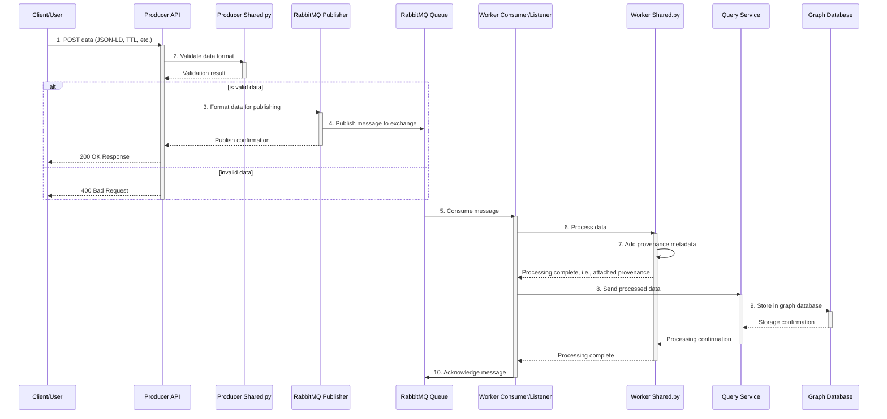

# Ingestion service

 # Ingestion Service Flow Diagram

```mermaid
sequenceDiagram
    participant Client as Client/User
    participant API as Producer API
    participant Validator as Producer Shared.py
    participant Publisher as RabbitMQ Publisher
    participant RabbitMQ as RabbitMQ Queue
    participant Consumer as Worker Consumer/Listener
    participant Processor as Worker Shared.py
    participant QueryService as Query Service
    participant GraphDB as Graph Database

    %% Client submits data
    Client->>API: 1. POST data (JSON-LD, TTL, etc.)
    activate API
    
    %% Producer service validates and publishes
    API->>Validator: 2. Validate data format
    activate Validator
    Validator-->>API: Validation result
    deactivate Validator
    
    alt is valid data
        API->>Publisher: 3. Format data for publishing
        activate Publisher
        Publisher->>RabbitMQ: 4. Publish message to exchange
        Publisher-->>API: Publish confirmation
        deactivate Publisher
        API-->>Client: 200 OK Response
    else invalid data
        API-->>Client: 400 Bad Request
    end
    deactivate API
    
    %% Worker service processes the message
    RabbitMQ->>Consumer: 5. Consume message
    activate Consumer
    Consumer->>Processor: 6. Process data
    activate Processor
    
    %% Processing steps
    Processor->>Processor: 7. Add provenance metadata
    
      %% Acknowledge message
    Processor-->>Consumer: Processing complete, i.e., attached provenance

    %% Send to query service
    Consumer->>QueryService: 8. Send processed data
    activate QueryService
    
    %% Store in database
    QueryService->>GraphDB: 9. Store in graph database
    activate GraphDB
    GraphDB-->>QueryService: Storage confirmation
    deactivate GraphDB
    
    QueryService-->>Processor: Processing confirmation
    deactivate QueryService
    
    %% Acknowledge message
    Processor-->>Consumer: Processing complete
    deactivate Processor
    Consumer->>RabbitMQ: 10. Acknowledge message
    deactivate Consumer
```